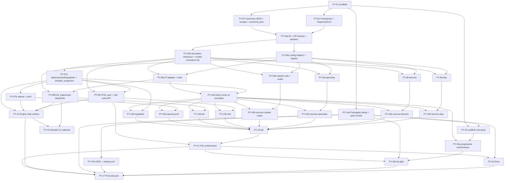

# Python Trajectory implementation specification

**Status:** Final for implementation (repository tip) — Round 6 residual panel closure  
**Authority:** `contracts/` + `conformance/` (not language APIs)  
**Target org:** [PyPI Hypabolic](https://pypi.org/org/Hypabolic/)  
**License:** MIT (root `LICENSE`, Copyright 2026 Hypabolic)  
**Repository:** https://github.com/Hypabolic/Trajectory

**Panel status:** All residual Round-5 review issues are **closed in this document**. There are **no** open decisions that must be resolved before coding. Implement against this text + `contracts/` + `conformance/` goldens.

---

## 1. Status and goals

### Status

Trajectory already ships three independent native runtimes (.NET, TypeScript, Rust) governed by shared wire contracts and a shared conformance suite. There is **no** `python/` tree, `pyproject.toml`, or PyPI project under org Hypabolic yet.

Published multi-registry packages are at **`0.1.0`** with sources `pi`, `claude-code`, `codex`, `openclaw`, `hermes` only (**no** `ahp`). Repository tip on `main` implements **AHP Shape A** offline ChatState snapshot decode under wire name `ahp` (protocol pin `0.7.x`) and advertises it in `contracts/compatibility.json` and runtime `runtime-capabilities.json`. Shipping AHP to registries requires a **new** git tag after `v0.1.0`; never retag or rewrite published `0.1.0`.

### Goals

1. Deliver an **independent native Python 3.11+** implementation of the Trajectory normalizer pipeline with **observable parity** to other runtimes for the same inputs, options, and contract version.
2. Publish **`hypabolic-trajectory`** to PyPI under org **Hypabolic**, synchronized with the multi-registry release model (git tag is version).
3. Pass shared `conformance/verify.py` for every source/output advertised in Python `runtime-capabilities.json`, including deterministic double-run equality of full protocol responses.
4. Keep **OpenTelemetry optional** (extra and/or separate dist); keep core free of OTEL SDK and SQLite hard dependencies.
5. Expose an idiomatic Python API while treating **versioned contracts + goldens** as the sole authority for wire behaviour.

### Hard constraints (non-negotiable)

1. **Independent native implementation** — no FFI, subprocess, WASM bridge, or calling other language Trajectory packages for normalize/project/list.
2. **Authority order** — (1) `contracts/` wire + behavioural specs, (2) `conformance/` fixtures and goldens, (3) `compatibility.json` + runtime capabilities. Private IR is **not** a public interchange format.
3. **Observable parity** with other runtimes for the same inputs/options/contract version (bytes, JSON, JSONL, diagnostic sequences, fatals, identity digests).
4. **Optional OTEL** stays optional (install extra / separate dist); pure `otel-genai-spans-v1` projection is side-effect free and **always available from core** without the extra.
5. **Explicit package names** under PyPI org Hypabolic and clear import paths (see §3, §6).
6. **Sources/outputs** aligned with repository tip (including `ahp` Shape A) for the first public multi-registry cut that includes Python (see §5).
7. **Conformance runner + CI gates** required before advertising any source/output.
8. **Version policy** synchronized with root `VERSION` / multi-registry releases (git tag is truth; stamp in CI).

---

## 2. Product fit and non-goals

### Product fit

Python sits beside .NET / TypeScript / Rust as a fourth **idiomatic native** runtime of one product:

| Concern | Decision |
| --- | --- |
| Decode → normalize → private IR → project | Same pipeline as other runtimes |
| Wire products | Only schema IDs in `contracts/compatibility.json` |
| Normalizer contract | `0.2.0` (pinned; identity-stable) |
| Diagnostics contract | `1` |
| Conformance protocol | `1` |
| Package SemVer | Same as NuGet/npm/crates for a given git tag |
| Embedded wire package strings | Must match other runtimes on the same tag (see §6); today tip + goldens pin `"0.1.0"` |
| IR serialization | Not a public product surface |
| Language API shape | Idiomatic Python; need not match C#/TS/Rust APIs |

Primary uses mirror the product: memory/reflection pipelines, cross-harness aggregation, evaluation/replay, Hypabolic ingestion, and deterministic OTEL GenAI span projection.

### Non-goals

- Calling `dotnet`, `node`, or Rust binaries from the Python package for product work.
- Stabilizing or documenting serialized private IR as an interchange format.
- Browser / WASM targets.
- Cloud ingestion product surface or live AHP host clients (AHP Shape B / listing / live host are deferred per `docs/ahp-ingest-status.md`).
- Public PyPI testing package on first ship (align with npm public set, not NuGet `Hypabolic.Trajectory.Testing`).
- Auto-accepting golden candidates in CI.
- Retagging `v0.1.0` or claiming multi-registry `0.1.0` parity for a tip-only capability set that includes AHP.
- Inventing provider, model, usage, or timing metadata not present in source input.
- SQLite-backed Hermes listing in core (empty-page / provider-side only, matching other cores).
- Publishing the conformance runner or sample CLI as PyPI console scripts / product entry points on first ship.

---

## 3. Package layout and public API (high level)

### Distribution map

| Dist name (PyPI) | Import path | Role | First ship |
| --- | --- | --- | --- |
| **`hypabolic-trajectory`** | `hypabolic_trajectory` | Core: normalize, project (including **pure** `project_otel_genai` / `otel-genai-spans-v1`), listing, contracts bundle, `runtime-capabilities.json`, and the **`hypabolic_trajectory.otel` submodule** (sink Protocol + `emit_to` with no SDK deps) | **Yes** |
| **`hypabolic-trajectory[otel]`** (extra on core) | same `hypabolic_trajectory.otel` | **Only** optional OpenTelemetry **SDK sink adapters** + `opentelemetry-*` deps. Does **not** gate pure projection or `emit_to` with a pure sink. | **Yes** (extra) |
| `hypabolic-trajectory-opentelemetry` | optional later | Separate dist only if hard registry-name parity with crates/NuGet is preferred later | **No** (defer) |
| Sample CLI (unpublished) | N/A | `python/samples/trajectory_cli` browse/list/show | Dev-only |
| Conformance runner (unpublished) | **not** installed by the published wheel | Protocol v1 stdin/stdout runner for `verify.py` | Dev/CI only |

**Pure vs extra (normative):** core **always** provides `project_otel_genai` and engine registration of pure `otel-genai-spans-v1` under `hypabolic_trajectory.project.otel_genai` (internal) and the root free function. The **`hypabolic_trajectory.otel` package always ships in the core wheel**. **`[otel]` adds only** concrete SDK sink helpers and the `opentelemetry-*` dependencies. **Forbid** requiring the extra to import or call pure projection or `emit_to` with a pure `SpanSetSink`.

**OTEL import matrix (normative):**

| Import / call | Without any `opentelemetry-*` installed | With `[otel]` extra |
| --- | --- | --- |
| `from hypabolic_trajectory import project_otel_genai` | **Succeeds** | Succeeds |
| `from hypabolic_trajectory.otel import SpanSetSink, emit_to` | **Succeeds** (submodule always present) | Succeeds |
| `emit_to(pure_sink, ir)` | Uses core `project_otel_genai` then `sink.emit`; **no** SDK import | Same |
| Concrete SDK helper symbols (if shipped, e.g. `SdkActivitySink`) | **`ImportError`** with install hint `pip install 'hypabolic-trajectory[otel]'` | Succeeds when deps present |
| Whole `hypabolic_trajectory.otel` package | **Never** absent from the wheel solely because the extra is missing | Same |

**Rationale for single core + `otel` extra:** matches the product rule that core must not hard-depend on OpenTelemetry SDK; pure projection and `emit_to` remain installable without the extra; avoids a second dist bootstrap on day one.

**Listing:** lives **in core** (Rust / .NET model), not a separate node-style package. Library listing always takes **explicit roots** for conformance safety; default home discovery may exist for interactive CLI use only and must never run in conformance mode.

**Hard first-ship packaging rule:** the published `hypabolic-trajectory` wheel has **no** `[project.scripts]` / `[project.gui-scripts]`, does **not** install `samples/` or the conformance runner, and must **not** market or ship `trajectory-conformance` as a PyPI console script. CI invokes the runner via the exact in-repo path in §7.

### Supported public import surface (semver-stable)

**Only these import paths are supported and semver-stable:**

1. **Package root** `hypabolic_trajectory` — names re-exported from `hypabolic_trajectory.__init__` via an explicit `__all__` (exhaustive table below).
2. **`hypabolic_trajectory.ir`** — multi-project IR surface (`ir.__all__` is the multi-project subset).
3. **`hypabolic_trajectory.otel`** — **always importable from the core wheel** for `SpanSetSink` and `emit_to`; SDK helpers may raise `ImportError` until `[otel]` is installed.

### Private-module import boundary (normative — no soft hedge)

**Rule (layout option B):** the package keeps readable internal module names (`api`, `engine`, `normalize`, `sources`, `project`, `listing`, `canonical`, …) for implementer navigation in §8, but:

1. Root / `ir` / `otel` package `__init__.py` files **must not** star-export or re-export internal module objects as public API beyond the exhaustive tables.
2. Importing any module path other than `hypabolic_trajectory`, `hypabolic_trajectory.ir`, and `hypabolic_trajectory.otel` is **unsupported** and **may break without notice** (no SemVer obligation).
3. Docs and README must state: *only names in root `__all__`, `hypabolic_trajectory.ir.__all__`, and `hypabolic_trajectory.otel.__all__` are semver-stable*.
4. Do not require a mass `_internal/` rename for first ship; do not document internal paths as supported.

### Constants and schema IDs

Export **named constants** (not a bare set) from the package root for attribute access, typing, and `TrajectoryEngine.project`:

```python
# hypabolic_trajectory (public constants)
from enum import StrEnum
from typing import Final, Literal, TypeAlias

NORMALIZER_CONTRACT_VERSION: Final[str] = "0.2.0"  # wire / identity contract

def _resolve_package_version() -> str:
    from importlib.metadata import PackageNotFoundError, version
    try:
        return version("hypabolic-trajectory")
    except PackageNotFoundError:
        # Editable/dev fallback only when distribution metadata is absent.
        # Must still match python/pyproject.toml [project].version when that file is present.
        return "0.0.0+local"

PACKAGE_VERSION: Final[str] = _resolve_package_version()
__version__ = PACKAGE_VERSION  # single public alias; not a second hand-maintained string

# Embedded wire version used for Hypabolic envelope normalizer.version and
# OTEL instrumentation_version. MUST match other tip runtimes on the same git
# tag. Today tip + goldens pin "0.1.0". See §6 wire-version policy — do NOT
# unilaterally bind this to PACKAGE_VERSION until all runtimes + goldens move.
WIRE_PACKAGE_VERSION: Final[str] = "0.1.0"  # until coordinated bump

LETTA_TRAJECTORY_V1: Final[str] = "letta-trajectory-v1"
LETTA_CANONICAL_V1: Final[str] = "letta-canonical-v1"
HYPABOLIC_TRAJECTORY_V1: Final[str] = "hypabolic-trajectory-v1"
OPENAI_CHAT_MESSAGES: Final[str] = "openai-chat-messages"
JSONL_MINIMAL: Final[str] = "jsonl-minimal"
OTEL_GENAI_SPANS_V1: Final[str] = "otel-genai-spans-v1"

SCHEMA_IDS: Final[frozenset[str]] = frozenset({
    LETTA_TRAJECTORY_V1,
    LETTA_CANONICAL_V1,
    HYPABOLIC_TRAJECTORY_V1,
    OPENAI_CHAT_MESSAGES,
    JSONL_MINIMAL,
    OTEL_GENAI_SPANS_V1,
})

# Built-in schema ids only — do NOT union with str (that collapses the Literal).
SchemaId: TypeAlias = Literal[
    "letta-trajectory-v1",
    "letta-canonical-v1",
    "hypabolic-trajectory-v1",
    "openai-chat-messages",
    "jsonl-minimal",
    "otel-genai-spans-v1",
]
# Extension points (custom adapters) use SchemaId | str at the parameter site.

IMPLEMENTED_SOURCES: Final[tuple[str, ...]] = (
    "pi", "claude-code", "codex", "openclaw", "hermes", "ahp",
)

class TrajectorySource(StrEnum):
    """Canonical public source type. Values equal wire names."""
    PI = "pi"
    CLAUDE_CODE = "claude-code"
    CODEX = "codex"
    OPENCLAW = "openclaw"
    HERMES = "hermes"
    AHP = "ahp"
```

**Source typing (v1 pin):** `NormalizeRequest.source` and `list_trajectories(source=...)` accept `TrajectorySource | str`. A `str` must equal a wire name. Unknown strings raise `TrajectoryError(code="unknown_source", ...)`. `normalize_to_ir` **always** returns `TrajectoryIR.source` as a `TrajectorySource` enum member equal to the wire name (never a bare arbitrary `str`).

**Version export pin:** forbid a second manually edited version string outside the stamp → `pyproject.toml` → `importlib.metadata` path. `PACKAGE_VERSION` and `__version__` both resolve through `_resolve_package_version()` (or equivalent single helper).

Canonical identity projections embed **`normalizer_version: "0.2.0"`** (contract version — never package SemVer).

Hypabolic trajectory envelope uses:

```text
normalizer.name = "Hypabolic.Trajectory"
normalizer.version = <WIRE_PACKAGE_VERSION>   # must match peers/goldens on this tag
```

OTEL projection uses `instrumentation_version = <WIRE_PACKAGE_VERSION>` with the same lockstep rule.

### Public type aliases (py.typed — normative)

```python
from typing import TypeAlias

JsonPrimitive: TypeAlias = None | bool | int | float | str
JsonValue: TypeAlias = JsonPrimitive | list["JsonValue"] | dict[str, "JsonValue"]
JsonObject: TypeAlias = dict[str, JsonValue]
```

Bare `dict` / `list` / `object` are **forbidden** as published annotations for projection trees. PEP 561 `py.typed` ships in the wheel.

### Exhaustive root `__all__` inventory (normative — single authority)

Root `__all__` **must list exactly** the union of the following names and **no others**. `hypabolic_trajectory.ir.__all__` is the multi-project IR subset (table later); root re-exports are exactly the “Yes” IR names plus the non-IR public names in this inventory. The import sketch is illustrative only — **this table wins** over any “exactly these names” language in sketches.

| Category | Names (all required in root `__all__`) |
| --- | --- |
| Version / constants | `NORMALIZER_CONTRACT_VERSION`, `PACKAGE_VERSION`, `__version__`, `WIRE_PACKAGE_VERSION`, `LETTA_TRAJECTORY_V1`, `LETTA_CANONICAL_V1`, `HYPABOLIC_TRAJECTORY_V1`, `OPENAI_CHAT_MESSAGES`, `JSONL_MINIMAL`, `OTEL_GENAI_SPANS_V1`, `SCHEMA_IDS`, `SchemaId`, `IMPLEMENTED_SOURCES`, `TrajectorySource` |
| JSON aliases | `JsonPrimitive`, `JsonValue`, `JsonObject` |
| Request / listing DTOs | `SourceContext`, `ToolArgumentBounds`, `ToolResultBounds`, `Bounds`, `Filters`, `NormalizeOptions`, `NormalizeRequest`, `TrajectoryListing`, `TrajectoryListingPage` |
| Diagnostics / errors / engine | `Diagnostic`, `TrajectoryError`, `TrajectoryEngine` |
| Free functions | `normalize_to_ir`, `normalize_to_letta`, `normalize_to_canonical`, `normalize_to_hypabolic`, `project_letta`, `project_canonical`, `project_hypabolic`, `project_openai`, `project_minimal_jsonl`, `project_otel_genai`, `list_trajectories`, `serialize_projection`, `canonical_json` |
| IR re-exports (see IR table) | `TrajectoryIR`, `IrRecord`, `RecordKind`, `TrajectoryRole`, `ToolCall`, `Provenance`, `SourceIdentityKind`, `SourceAnchorKind`, `RecordHashes`, `AppliedConfig`, `AppliedBounds`, `AppliedFilters`, `TrajectoryExecution`, `ModelInvocation`, `ModelTokenUsage`, `WorkflowInvocation` |

Optional alias `TrajectoryDiagnostic = Diagnostic` is **not** required and **must not** appear in root `__all__` unless a future issue explicitly adds it. Primary public diagnostic name is **`Diagnostic`**.

**First-ship engine pin (decision A):** `TrajectoryEngine` **is** in root `__all__` and is **required** on the first public tag. PY-12 delivers a working `create_default` / `project` / `add_output_adapter` surface and is on the PY-17 / §11 DoD #5 ship path. Intermediate tags before PY-12 may omit a functional engine only in private/development builds; the first multi-registry public tag **must not** publish a root `__all__` that lists `TrajectoryEngine` without the methods working.

### Public API sketch (idiomatic, not wire-stable)

Primary surface: **free functions** (Rust-like clarity) with optional **`TrajectoryEngine`** registry sugar (TS/.NET ergonomics). Free functions are the surface the conformance runner invokes; the engine is sugar required on first ship (PY-12).

#### Free functions + TrajectoryEngine binding (normative — isolation pin)

1. **Import alone is enough:** `import hypabolic_trajectory` (or `from hypabolic_trajectory import …`) **registers all built-in sources, listers, and projectors**. Free functions work with **no** `TrajectoryEngine.create_default()` call.
2. **Free functions ALWAYS invoke built-in adapters/projectors only.** They **MUST NOT** observe adapters registered via any `TrajectoryEngine.add_output_adapter` call (or any other engine mutation). Conformance and primary product paths use free functions.
3. **Each `create_default()` returns an independent engine.** Mutations on one engine (including `add_output_adapter`) cannot affect free functions or other engine instances.
4. **`engine.normalize_to_ir` uses the same built-in source set as free functions.** There is **no** public custom-source registration in v1.
5. **`engine.project`** dispatches built-ins from `create_default` plus any custom adapters on **that** engine instance only; unknown schema → `TrajectoryError(code="unknown_output_schema")`.

```python
from hypabolic_trajectory import (
    NORMALIZER_CONTRACT_VERSION,
    PACKAGE_VERSION,
    __version__,
    WIRE_PACKAGE_VERSION,
    LETTA_TRAJECTORY_V1,
    LETTA_CANONICAL_V1,
    HYPABOLIC_TRAJECTORY_V1,
    OPENAI_CHAT_MESSAGES,
    JSONL_MINIMAL,
    OTEL_GENAI_SPANS_V1,
    SCHEMA_IDS,
    SchemaId,
    IMPLEMENTED_SOURCES,
    TrajectorySource,
    JsonPrimitive,
    JsonValue,
    JsonObject,
    Bounds,
    ToolArgumentBounds,
    ToolResultBounds,
    Filters,
    NormalizeOptions,
    NormalizeRequest,
    SourceContext,
    Diagnostic,
    TrajectoryListing,
    TrajectoryListingPage,
    TrajectoryIR,
    TrajectoryEngine,
    TrajectoryError,
    normalize_to_ir,
    normalize_to_letta,
    normalize_to_canonical,
    normalize_to_hypabolic,
    project_letta,
    project_canonical,
    project_hypabolic,
    project_openai,
    project_minimal_jsonl,
    project_otel_genai,
    list_trajectories,
    serialize_projection,
    canonical_json,
    # plus all IR re-exports in the exhaustive table
)
```

#### Request / options DTO tree (explicit; snake_case; keyword-only)

**Normative construction rules for all public dataclasses in this section and IR:**

1. Use `@dataclass(frozen=True, slots=True, kw_only=True)`.
2. Nested defaults via `field(default_factory=...)` or module-level **frozen** singletons — **never** shared mutable default instances (RUF009).
3. Required fields after optionals are valid only because of `kw_only=True`.
4. Triple-state bounds semantics remain unchanged (default 20000/2500; `None` disables).

```python
from dataclasses import dataclass, field
from typing import Literal

@dataclass(frozen=True, slots=True, kw_only=True)
class SourceContext:
    group_id: str | None = None
    base_byte_offset: int = 0          # signed int64 checked at free-function entry
    partial: bool = False

@dataclass(frozen=True, slots=True, kw_only=True)
class ToolArgumentBounds:
    max_characters: int | None = 20_000

@dataclass(frozen=True, slots=True, kw_only=True)
class ToolResultBounds:
    max_characters: int | None = 2_500
    strategy: Literal["head", "head-tail"] = "head-tail"

@dataclass(frozen=True, slots=True, kw_only=True)
class Bounds:
    tool_arguments: ToolArgumentBounds = field(default_factory=ToolArgumentBounds)
    tool_results: ToolResultBounds = field(default_factory=ToolResultBounds)

@dataclass(frozen=True, slots=True, kw_only=True)
class Filters:
    tool_results: Literal["include", "omit"] = "include"

@dataclass(frozen=True, slots=True, kw_only=True)
class NormalizeOptions:
    bounds: Bounds = field(default_factory=Bounds)
    filters: Filters = field(default_factory=Filters)

@dataclass(frozen=True, slots=True, kw_only=True)
class NormalizeRequest:
    source: TrajectorySource | str     # required
    transcript: bytes | str            # required — prefer bytes
    source_context: SourceContext = field(default_factory=SourceContext)
    options: NormalizeOptions = field(default_factory=NormalizeOptions)
```

**Bounds/filters semantics (normative):**

| Caller state | Meaning |
| --- | --- |
| Field omitted / default factory | Use contract defaults (20000 / 2500 / head-tail / include) |
| `max_characters=None` | Disable that bound |
| Positive `int` | Apply limit (Unicode scalar values) |
| Argument `max_characters == 1` or `<= 0` (non-None) | `invalid_input` at free-function entry |
| Result `max_characters <= 0` (non-None) | `invalid_input` at free-function entry |

#### Validation boundary (normative)

| Stage | Raises | When |
| --- | --- | --- |
| **Dataclass construction** | **Never** domain `TrajectoryError` | Out-of-range ints, odd bounds, etc. are **allowed** on construction |
| **Free-function / engine entry — Python types** | `TypeError` / `ValueError` | Wrong types (e.g. `transcript` not `bytes`/`str`; missing required kwargs); **programmer mistakes** such as duplicate `add_output_adapter` schema_id → **`ValueError`** |
| **Free-function / engine entry — domain contract** | `TrajectoryError` with wire codes | Signed int64 range on `base_byte_offset` / sequences / timestamps / tokens; bounds limits; unknown source/schema; listing limit/cursor; encode failures mapped to `invalid_input`; other `diagnostics.md` codes |

**Pin:** do **not** validate int64/domain rules in `__post_init__` with `TrajectoryError`. Construction of DTOs with out-of-range ints is allowed until an operation is invoked. If a future revision prefers construction-time checks, they must raise **`ValueError` only** — never mix `TrajectoryError` at construction with domain codes at entry.

**Request field / int64 / bytes policy:**

- `transcript: bytes | str` — **single field only**. Prefer **`bytes`**. If `str`, encode **once** as UTF-8 **strict**. `UnicodeEncodeError` → catch and `raise TrajectoryError(code="invalid_input", message=<content-safe fixed text>) from None` (see exception chaining). Wrong types raise `TypeError` **before** domain work. Anchors always refer to the resulting UTF-8 bytes.
- `base_byte_offset: int` default `0` — must fit **signed int64** (`-2^63 .. 2^63-1`) or `invalid_input` at free-function entry.
- Sequences, offsets, timestamps (epoch ms), token counts: lossless signed int64. JSON adapters that parse wire numbers must not coerce through float.
- `partial: bool`; `group_id: str | None`.
- `SourceContext` lives on the request only.

#### Normalize / project free functions

```python
def normalize_to_ir(request: NormalizeRequest) -> TrajectoryIR: ...
def normalize_to_letta(request: NormalizeRequest) -> JsonObject: ...
def normalize_to_canonical(request: NormalizeRequest) -> JsonObject: ...
def normalize_to_hypabolic(request: NormalizeRequest) -> JsonObject: ...

def project_letta(trajectory: TrajectoryIR) -> JsonObject: ...
def project_canonical(trajectory: TrajectoryIR) -> JsonObject: ...
def project_hypabolic(trajectory: TrajectoryIR) -> JsonObject: ...
def project_openai(trajectory: TrajectoryIR) -> list[JsonObject]: ...
def project_minimal_jsonl(trajectory: TrajectoryIR) -> str: ...
def project_otel_genai(trajectory: TrajectoryIR) -> JsonObject: ...

def serialize_projection(value: JsonValue, *, write_indented: bool = False) -> str: ...
def canonical_json(value: JsonValue) -> str: ...
```

**Projection return types and wire key casing (pinned):**

- `project_*` returns **JsonObject / list[JsonObject] / str** matching each schema’s root JSON type, already using schema wire key casing matching goldens.
- **`project_openai(...) -> list[JsonObject]`** (JSON array root).
- Object projectors return **`JsonObject`**.
- **`project_minimal_jsonl` returns `str`** — do **not** pass it through `serialize_projection`.
- Convenience `normalize_to_*` = `normalize_to_ir` + corresponding `project_*`. **Exception:** `normalize_to_canonical` / `project_canonical` may raise `source_group_required` even when `normalize_to_ir` succeeded.
- **`project_*` never re-decode native input**.

**Mutability guarantees (normative):**

1. `TrajectoryIR` is **immutable** after return from `normalize_to_ir`.
2. `project_*` **must not mutate** the IR.
3. Each `project_*` returns a **new** tree or string.
4. Diagnostics on IR are a **read-only sequence**; schema copies use wire casing on the projection only (see diagnostic casing matrix below).

#### Public emit architecture (byte-exact parity — peer model)

1. **`project_*` construct** trees in **fixed field order** matching tip projectors/goldens.
2. **Null policy (golden rule — NOT omit-all-nulls):** fixed field sets including explicit JSON `null` where goldens have null; omit only optional-absent keys; `serialize_projection` **preserves** nulls; listing pages **always** emit `next_cursor` as `string | null`.
3. **`serialize_projection`** emits compact (or indented) UTF-8 using the **shared Trajectory string-escape algorithm**, preserving insertion order; never sorts keys.
4. **`serialize_projection` accepts only** JSON-serializable trees from object `project_*`. Invalid value types raise `TypeError`. Not used for `project_minimal_jsonl`.
5. **`write_indented`:** 2-space indent, `\n` newlines, no trailing whitespace; match goldens for trailing newline policy. Compact separators `(",", ":")`.
6. **JSON number emit (normative — both `serialize_projection` and `canonical_json`):** emit numbers from Python `int` (or exact integer types) using **invariant decimal formatting with no exponent notation**; **never** coerce trajectory int64 fields (offsets, sequences, sizes, token counts, timestamps) through `float`; **reject non-finite floats** (`nan`/`inf`/`-inf`) with `TypeError`. Cross-link `contracts/spec/canonical-json.md` integer range `[-2^63, 2^63-1]`. Product `serialize_projection` uses the same integer emit as identity `canonical_json` for integer values. bool/null/array/object rules unchanged.
7. **`canonical_json(value: JsonValue) -> str` error model:** same invalid-tree policy as `serialize_projection` — **`TypeError`** for non-JSON-serializable values and non-finite floats. Identity hashing only passes already-constructed JSON trees and **must not** raise `TrajectoryError` for programmer type mistakes.
8. **Only identity hashing** uses Trajectory canonical JSON (UTF-16 code-unit key sort via `canonical_json`).
9. **Comparison modes:** `json-exact`, `byte-exact`, `jsonl-exact`.
10. **Conformance / product emit path:** for JSON ops, `output_text = serialize_projection(project_*(ir), write_indented=...)`. For jsonl, `output_text = project_minimal_jsonl(ir)`. **Forbid** stdlib `json.dumps` for product/conformance emit of these schemas.

#### Trajectory string-escape algorithm (normative)

Shared by `canonical_json`, `serialize_projection`, and each `project_minimal_jsonl` line:

1. Walk the string as **UTF-16 code units**.
2. Emit opening/closing `"`.
3. For each unit `u`: `"` `\\` `\b` `\t` `\n` `\f` `\r` short forms; else if in `U+0000–001F`, `U+E000–F8FF`, `U+2028`, `U+2029`, or `U+D800–DFFF` → `\uXXXX` **four uppercase** hex; else UTF-8.
4. **Do not** escape solidus `/`.
5. **Do not** apply Unicode normalization.
6. No BOM; no insignificant whitespace in compact mode.

**Compact / relaxed JSON (normative alias):** for identity tuples that are JSON **arrays** (no object key order), `serialize_projection` compact emit of the array, tip `relaxed_json` / TS `compactJson`, and array form of `canonical_json` are byte-equivalent. Spec text uses **`compact_json` / `serialize_projection` on array trees** for model-invocation and hypabolic `trajectory_id` hashes.

**PY-02 unit vectors (required):** emoji / supplementary-plane, BMP private-use (`U+E000`), `U+2028`/`U+2029`, control chars, quote/backslash, and surrogate-pair cases against checked-in golden bytes (at minimum vectors equivalent to `pi/unicode-boundaries` and Rust `{"\uD800\uDC00":"\uD83D\uDE00","\uE000":"\u2028"}`). **PY-02 delivers public `canonical_json`** (+ identity/escape primitives) with those unit vectors.

#### `project_minimal_jsonl` wire form

Byte oracle: `conformance/cases/pi/unicode-boundaries/expected.minimal.jsonl`.

| Pin | Value |
| --- | --- |
| Document shape | One compact JSON object per IR record **including meta**, each line terminated by `\n` (**final newline required**) |
| **Timestamp clock (normative)** | Body line `timestamp` uses **filled IR `timestamp_ms` only** (record filled/synthesized clock), **never** `source_timestamp_ms`. Format: three-digit ms UTC as peer `...fffZ`, then replace trailing `Z` with `+00:00` → `yyyy-MM-ddTHH:mm:ss.fff+00:00`. **Omit** the `timestamp` key when filled `timestamp_ms` is `None` (typical meta). |
| `kind` | `ir.kind` with **all `_` removed** |
| `role` | IR role wire name unchanged |
| Field construction order | `id`, `order`, `kind`, `role`, then optional `timestamp`, `content`, `tool_call_id`, `tool_name`, `is_error`, `tool_calls` |
| Meta | Include meta; `order: -1`; no timestamp when absent |
| Escaping | Shared Trajectory string-escape algorithm |
| Serializer | Do **not** pass the completed document through `serialize_projection` |

Message / canonical / Hypabolic public timestamps remain **`yyyy-MM-ddTHH:mm:ss.fffZ`** from **filled `timestamp_ms`** (not source). Listing `updated_at` uses the `Z` form. Only jsonl-minimal uses `+00:00` on the filled-ms clock (three fractional digits). OTEL uses the seven-digit pad formula in §4.

#### Hypabolic projection pins (non-invertible ids — normative)

Authority: tip Rust `hypabolic_value` / TS `projectHypabolic` / goldens `expected.hypabolic.json`.

| Field | Formula / rule |
| --- | --- |
| `trajectory_id` | `sha256(utf8(compact_json([source_wire_name, group_id])))` where `source_wire_name` is IR `source` wire value (e.g. `"pi"`) and `group_id` is the **resolved** IR group id. Digests are **64 lowercase hex**. Cannot be reverse-derived from goldens — implement this formula. |
| `source.type` | Wire name (`trajectory.source`) |
| `source.name` | `trajectory.source_name` |
| `source.group_id` | Resolved group id |
| `source.producer_version` | Omit when IR `producer_version` is absent; include when present |
| `segment.partial` | `AppliedConfig.partial or AppliedConfig.base_byte_offset != 0` |
| `segment.base_byte_offset` | `AppliedConfig.base_byte_offset` (JSON number, lossless int64) |
| `normalizer.name` | `"Hypabolic.Trajectory"` |
| `normalizer.version` | `WIRE_PACKAGE_VERSION` |
| Root field order | Match tip/goldens (tie-break: reverse-derive unspecified ordering only) |
| Diagnostics on Hypabolic | Snake_case optional fields `input_line` / `record_index` when present |

**PY-07a unit vector (required):** compute `trajectory_id` for known `(source_wire_name, group_id)` pairs (at least `pi` + `unicode-session` matching `pi/unicode-boundaries/expected.hypabolic.json` and partial-chunk partial/base cases). **PY-07a delivers public `serialize_projection`** wired to the shared escape (from PY-02) and used by project/normalize_to_* emit.

#### Diagnostics (success path — in-process)

```python
@dataclass(frozen=True, slots=True, kw_only=True)
class Diagnostic:
    code: str
    message: str
    input_line: int | None = None
    record_index: int | None = None
    count: int | None = None
```

- Export **`Diagnostic`** from the package root as the primary name.
- Success-path access: `normalize_to_ir(...).diagnostics` — Python snake_case attributes.
- `project_*` copy diagnostics into each schema’s documented field casing (matrix below).
- Never put stacks, raw transcript, tool payloads, paths, or secrets into messages.
- Always omit null optionals; never emit stacks/payloads.

#### Schema → diagnostic optional-field casing matrix (normative — exhaustive)

Authority: tip Rust `diagnostics_value(..., snake_case)` flag (`true` only for hypabolic; `false` for letta/canonical) and OTEL `model_span_omitted` shape.

| Surface / schema | Optional location keys | Notes |
| --- | --- | --- |
| **Protocol response** (`status=success` diagnostics array) | `inputLine`, `recordIndex`, `count` | Always `code`+`message`; camelCase optionals; omit when null |
| **`letta-trajectory-v1`** | `inputLine`, `recordIndex`, `count` | camelCase |
| **`letta-canonical-v1`** | `inputLine`, `recordIndex`, `count` | camelCase |
| **`hypabolic-trajectory-v1`** | `input_line`, `record_index`, `count` | snake_case |
| **`openai-chat-messages`** | (no diagnostics array on product root) | N/A |
| **`jsonl-minimal`** | (no diagnostics array on product document) | N/A |
| **`otel-genai-spans-v1`** diagnostics | `code`, `message`, and for `model_span_omitted` **`record_id`** (invocation id string) — **not** `record_index` / `recordIndex` | Exact fixture message text in §4 |

#### `list_trajectories` public signature

```python
@dataclass(frozen=True, slots=True, kw_only=True)
class TrajectoryListing:
    id: str
    path: str
    updated_at: str | None = None
    title: str | None = None
    size_bytes: int | None = None

@dataclass(frozen=True, slots=True, kw_only=True)
class TrajectoryListingPage:
    items: tuple[TrajectoryListing, ...]
    next_cursor: str | None = None  # ALWAYS present on wire as string or null

def list_trajectories(
    *,
    source: TrajectorySource | str,
    root: str | Path,
    cursor: str | None = None,
    limit: int = 50,
) -> TrajectoryListingPage: ...
```

| Field | Format |
| --- | --- |
| `updated_at` | Optional `yyyy-MM-ddTHH:mm:ss.fffZ`; omit on wire when None |
| `path` | Native locator `str` on DTO; `Path` accepted only on input `root` |
| `size_bytes` | Optional non-negative; signed int64 range (checked at entry) |
| `title` | Optional; omit when absent |
| `next_cursor` | Always emit key: string or JSON `null` |

- Library and conformance **always** require explicit `root`.
- Default-home discovery is **sample-CLI only**.
- Bad limit/cursor → `TrajectoryError(code="invalid_input", ...)` at free-function entry.
- Source without a lister → `listing_unavailable`.
- Missing store → empty page.

#### Error model (`TrajectoryError` contract)

```python
class TrajectoryError(Exception):
    """Domain fatal. Catchable; stable wire code + content-safe message."""

    def __init__(self, code: str, message: str) -> None:
        self.code = code
        self.message = message
        super().__init__(f"{code}: {message}")

    def __str__(self) -> str:
        return f"{self.code}: {self.message}"

    def __repr__(self) -> str:
        return f"TrajectoryError(code={self.code!r}, message={self.message!r})"

    def __eq__(self, other: object) -> bool:
        if not isinstance(other, TrajectoryError):
            return NotImplemented
        return self.code == other.code and self.message == other.message
```

- Domain fatals always use this type with **string** wire codes.
- Pure programming mistakes may raise `TypeError` / `ValueError` **before** domain work.
- Conformance runner maps domain fatals to `{status:"fatal-error", fatal_error:{code,message}}` and **exits 0**.
- Protocol / I/O failures → `status:"protocol-error"`, **exit 2**.
- Never put exception types, stacks, transcript prose, tool payloads, raw JSON, paths, or secrets into public messages. `__str__` / `__repr__` must remain content-safe.

**Exception chaining (normative — content safety):** when translating caught `UnicodeEncodeError`, parse/OS/JSON errors, or other low-level exceptions into domain `TrajectoryError`, implementers **must** use:

```python
raise TrajectoryError(code, message) from None
```

(or equivalent) so `__cause__` / `__context__` do **not** retain transcript fragments, paths, or raw payloads. Messages remain fixture-stable and content-safe. **Unit acceptance:** traceback of the public exception does not include transcript bytes/text.

#### `TrajectoryEngine` method surface (required on first ship)

```python
class TrajectoryEngine:
    @classmethod
    def create_default(cls) -> TrajectoryEngine:
        """Register all built-in schema projectors for the tip matrix,
        including pure otel-genai. Independent of free functions."""

    def add_output_adapter(
        self,
        schema_id: SchemaId | str,  # built-ins typed; custom ids accepted at runtime
        projector: Callable[[TrajectoryIR], JsonValue],
    ) -> TrajectoryEngine: ...

    def normalize_to_ir(self, request: NormalizeRequest) -> TrajectoryIR: ...

    def project(self, trajectory: TrajectoryIR, schema_id: SchemaId | str) -> JsonValue: ...

    def normalize_to_letta(self, request: NormalizeRequest) -> JsonObject: ...
    def normalize_to_canonical(self, request: NormalizeRequest) -> JsonObject: ...
    def normalize_to_hypabolic(self, request: NormalizeRequest) -> JsonObject: ...
```

| Situation | Exception |
| --- | --- |
| `add_output_adapter` duplicate `schema_id` | **`ValueError`** (content-safe message; **not** `TrajectoryError`) |
| `project` unknown / unregistered `schema_id` | `TrajectoryError(code="unknown_output_schema", ...)` |
| `create_default()` | Registers pure `otel-genai-spans-v1` and all tip projectors on **that** engine only |

- Custom source adapters in v1: **no** public registration.
- Listing stays free function `list_trajectories`.

#### `hypabolic_trajectory.otel` public surface (first ship)

```python
# hypabolic_trajectory.otel — always present in the core wheel
from typing import Protocol

class SpanSetSink(Protocol):
    def emit(self, span_set: JsonObject) -> None: ...

def emit_to(sink: SpanSetSink, trajectory: TrajectoryIR) -> None:
    """Project via core project_otel_genai and deliver the span set to sink.
    Does not require opentelemetry-* packages. Concrete SDK helper constructors
    (if any) raise ImportError with install hint when SDK deps are missing.
    Pure projection itself must not be imported from this module as the only path.
    """
    ...
```

| Pin | Rule |
| --- | --- |
| `otel.__all__` | Exactly `("SpanSetSink", "emit_to")` plus any optional thin SDK helper name explicitly listed in the same table when implemented (e.g. `SdkActivitySink` if shipped). **No other names.** |
| Pure projection import | `from hypabolic_trajectory import project_otel_genai` (core) — **not** otel-only |
| Missing SDK | Only **SDK helper** symbols raise `ImportError`; document install line `pip install 'hypabolic-trajectory[otel]'`. **`SpanSetSink` / `emit_to` never require the extra.** |
| Failure modes | Sink `emit` errors propagate as ordinary exceptions; domain fatals from project use `TrajectoryError` |

### IR public type — typed multi-project surface (normative minimum)

Root IR type name: **`TrajectoryIR`**. Detailed types under `hypabolic_trajectory.ir` with explicit stable `__all__`. IR is **immutable** after `normalize_to_ir` returns. All IR public dataclasses use `@dataclass(frozen=True, slots=True, kw_only=True)`.

##### Public IR enums

```python
class RecordKind(StrEnum):
    META = "meta"
    MESSAGE = "message"
    ASSISTANT_TOOL_CALLS = "assistant_tool_calls"
    TOOL_RESULT = "tool_result"

class TrajectoryRole(StrEnum):
    META = "meta"
    USER = "user"
    REASONING = "reasoning"
    ASSISTANT = "assistant"
    TOOL = "tool"

class SourceIdentityKind(StrEnum):
    NATIVE = "native"
    LOCATION = "location"
    CONTENT = "content"
    SYNTHETIC = "synthetic"

class SourceAnchorKind(StrEnum):
    BYTE = "byte"
    ORDINAL = "ordinal"
    ROW = "row"
    SEQUENCE = "sequence"
```

##### IR sketches

```python
@dataclass(frozen=True, slots=True, kw_only=True)
class ModelTokenUsage:
    input_tokens: int | None = None
    output_tokens: int | None = None
    cache_read_tokens: int | None = None
    cache_write_tokens: int | None = None
    total_tokens: int | None = None

@dataclass(frozen=True, slots=True, kw_only=True)
class ModelInvocation:
    id: str                            # required — formula in §4
    native_record_id: str | None = None
    source_sequence: int | None = None
    source_offset: int | None = None   # ABSOLUTE after base_byte_offset (see §4)
    provider: str | None = None
    api_family: str | None = None
    requested_model: str | None = None
    response_model: str | None = None
    response_id: str | None = None
    stop_reason: str | None = None
    producer_version: str | None = None
    usage: ModelTokenUsage | None = None  # omitted entirely when all token fields absent
    started_at_ms: int | None = None
    started_at_precise: str | None = None
    first_response_at_ms: int | None = None
    first_response_at_precise: str | None = None
    completed_at_ms: int | None = None
    completed_at_precise: str | None = None

@dataclass(frozen=True, slots=True, kw_only=True)
class WorkflowInvocation:
    id: str
    name: str | None = None
    native_record_id: str | None = None
    started_at_ms: int | None = None
    started_at_precise: str | None = None
    completed_at_ms: int | None = None
    completed_at_precise: str | None = None

@dataclass(frozen=True, slots=True, kw_only=True)
class TrajectoryExecution:
    model_invocations: tuple[ModelInvocation, ...]
    workflow_invocations: tuple[WorkflowInvocation, ...] = ()

@dataclass(frozen=True, slots=True, kw_only=True)
class AppliedBounds:
    tool_arguments_max_characters: int | None
    tool_results_max_characters: int | None
    tool_results_strategy: Literal["head", "head-tail"]

@dataclass(frozen=True, slots=True, kw_only=True)
class AppliedFilters:
    tool_results: Literal["include", "omit"]

@dataclass(frozen=True, slots=True, kw_only=True)
class AppliedConfig:
    bounds: AppliedBounds
    filters: AppliedFilters
    group_id: str | None
    base_byte_offset: int
    partial: bool

@dataclass(frozen=True, slots=True, kw_only=True)
class ToolCall:
    id: str
    name: str
    arguments_json: str

@dataclass(frozen=True, slots=True, kw_only=True)
class Provenance:
    stable_source_record_id: str
    source_identity_kind: SourceIdentityKind
    source_order_id: str
    component_key: str
    component_index: int
    component_type_ordinal: int
    native_record_id: str | None = None
    producer_version: str | None = None
    source_sequence: int | None = None
    source_offset: int | None = None   # segment-relative on provenance
    source_anchor_kind: SourceAnchorKind | None = None

@dataclass(frozen=True, slots=True, kw_only=True)
class RecordHashes:
    content_sha256: str
    record_sha256: str

@dataclass(frozen=True, slots=True, kw_only=True)
class IrRecord:
    id: str
    kind: RecordKind
    role: TrajectoryRole
    order: int
    provenance: Provenance
    hashes: RecordHashes
    source_timestamp_ms: int | None = None
    source_timestamp_precise: str | None = None
    timestamp_ms: int | None = None    # filled/synthesized ms — public message/jsonl clocks
    content: str | None = None
    source_name: str | None = None
    cwd: str | None = None
    git_branch: str | None = None
    model: str | None = None
    producer_version: str | None = None
    tool_calls: tuple[ToolCall, ...] = ()
    tool_call_id: str | None = None
    tool_name: str | None = None
    is_error: bool | None = None

@dataclass(frozen=True, slots=True, kw_only=True)
class TrajectoryIR:
    source: TrajectorySource           # NOT bare str — enum member equal to wire name
    source_name: str
    group_id: str
    source_group_resolved: bool
    records: tuple[IrRecord, ...]
    diagnostics: tuple[Diagnostic, ...]
    config: AppliedConfig
    execution: TrajectoryExecution
    producer_version: str | None = None
```

#### Dual timing (end-to-end, normative)

| Layer | Fields |
| --- | --- |
| Decoded events | `timestamp_ms` + optional `timestamp_precise` |
| Decoded model invocations | dual started / first_response / completed |
| IR records | `source_timestamp_ms` + `source_timestamp_precise` (decode copy); `timestamp_ms` filled/synthesized |
| IR model / workflow invocations | dual timing as available |
| Message / canonical / Hypabolic public timestamps | three-digit `...fffZ` from **filled `timestamp_ms` only** |
| **jsonl-minimal timestamps** | three-digit `...fff+00:00` from **filled `timestamp_ms` only**; forbid `source_timestamp_ms` |
| OTEL span bounds | see §4 peer pad formula |

#### Stable `hypabolic_trajectory.ir` export table

| Name | Also re-exported at package root? |
| --- | --- |
| `TrajectoryIR` | **Yes** |
| `IrRecord` | Yes |
| `RecordKind` | Yes |
| `TrajectoryRole` | Yes |
| `ToolCall` | Yes |
| `Provenance` | Yes |
| `SourceIdentityKind` | Yes |
| `SourceAnchorKind` | Yes |
| `RecordHashes` | Yes |
| `AppliedConfig` | Yes |
| `AppliedBounds` | Yes |
| `AppliedFilters` | Yes |
| `TrajectoryExecution` | Yes |
| `ModelInvocation` | Yes |
| `ModelTokenUsage` | Yes |
| `WorkflowInvocation` | Yes |
| `Diagnostic` | Yes (primary root name) |

`hypabolic_trajectory.ir.__all__` **must** list exactly these names (order free).

### Typing and dependencies

Python **3.11+**. Prefer **stdlib + light deps** in core. OTEL SDK only under extra `otel`. Do **not** require Pydantic in core for first ship. Ship `py.typed`.

### IR visibility summary

- In-process typed IR via `normalize_to_ir` for multi-project and tests.
- Do **not** document IR JSON as a stable cross-language wire format.
- Submodule `hypabolic_trajectory.ir` holds the stable multi-project surface.

---

## 4. Architecture mapping (decode → normalize → IR → project)

```text
native transcript (exact UTF-8 bytes)
        │
        ▼
┌───────────────────────┐
│ source adapter        │  source-specific decode only
└───────────┬───────────┘
            │
            ▼
┌───────────────────────┐
│ decoded session       │  events (ms + optional precise),
│                       │  anchors, native IDs,
│                       │  model invocations (dual timing)
└───────────┬───────────┘
            │
            ▼
┌───────────────────────┐
│ normalization core    │  groups, linking, bounds, timestamps,
│                       │  diagnostics, identity digests;
│                       │  model-invocation absolute offsets +
│                       │  invocation.id formula; copies dual
│                       │  timing + execution → IR
└───────────┬───────────┘
            │
            ▼
┌───────────────────────┐
│ private TrajectoryIR  │  records + diagnostics + AppliedConfig +
│                       │  execution (model + workflow invocations)
└───────────┬───────────┘
            │
     ┌──────┼──────┬──────────┬────────────┐
     ▼      ▼      ▼          ▼            ▼
  letta   canonical  hypabolic  openai   otel-genai
  msg-v1  identity   traj-v1    chat     spans-v1
  (+ jsonl-minimal)
```

### Module responsibilities

| Layer | Owns | Must not |
| --- | --- | --- |
| Source adapters (`sources/*`) | Parse native formats; preserve native ID/group/sequence/timestamp/anchors/model invocations | Shared bounds, tool-linking, output shapes, invented metadata |
| Normalizer (`normalize/`) | Group resolution, whole/partial, tool linking, bounds, filled timestamps, diagnostics, identity, **model-invocation identity formula**, absolute offsets | Source dialects; projection field order; **must not raise `source_group_required`** |
| Private IR (`ir/models`) | Full record + provenance + hashes + dual timestamps + AppliedConfig + execution | Public interchange stability |
| Projections (`project/`) | Map IR → schema IDs; hypabolic `trajectory_id`/segment; OTEL algorithm | Re-decode native transcripts |
| Listing (`listing/`) | Explicit-root discovery via **Lister registry Protocol**; cursor pagination | Home reads in conformance |
| Canonical JSON / identity | UTF-16 key order, digests, record IDs, shared escape | RFC 8785 for identity |

### Private IR execution metadata + dual timestamps (required for first-ship OTEL)

**Normative Python requirements:**

1. Source adapters emit decoded model invocations when present (**no fabrication**), with dual timing.
2. Decoded events carry `timestamp_ms` plus optional `timestamp_precise`.
3. Normalizer copies both onto IR records and model invocations. Never invent precise strings.
4. Filled body timestamps use ms only (`timestamp_ms`); public message/canonical/Hypabolic from filled ms as `...fffZ`; jsonl-minimal as `...fff+00:00` from **filled** ms only.
5. `workflow_invocations` defaults to empty; **never fabricate**.

### Model-invocation identity formula (normative — non-invertible; tip parity)

Cross-link: `contracts/spec/identity.md` component key **`model-invocation`**. Tip .NET/TS/Rust share this formula. Without it, OTEL `model_span_omitted.record_id` and model `span_id` seeds cannot match goldens.

When mapping each `DecodedModelInvocation` into IR `ModelInvocation` during `normalize_to_ir`:

1. **Absolute offset**  
   - If decoded `source_offset` is present:  
     `absolute_offset = decoded.source_offset + base_byte_offset` using **checked signed int64** addition. Overflow → `TrajectoryError(code="invalid_input", message=<content-safe fixed text>)`.  
   - IR `ModelInvocation.source_offset` stores this **absolute** value (not segment-relative).
2. **Identity string** (first match wins):  
   - If `native_record_id` is **non-empty** → use it.  
   - Else if absolute offset is present → `sha256(utf8(f"{group_id}|byte|{absolute_offset}"))` (64 lowercase hex).  
   - Else if `response_id` is present → use `response_id`.  
   - Else literal `"model-invocation"`.
3. **`invocation.id`** =  
   `sha256(utf8(compact_json([group_id, identity, "model-invocation"])))`  
   — same **3-element array** shape as record ids (`[group, stable_id, component_key]`), compact JSON array, shared escape. Digests 64 lowercase hex.
4. **Usage:** set `usage` to `None` (omit entirely) when **all** of `input_tokens`, `output_tokens`, `cache_read_tokens`, `cache_write_tokens`, `total_tokens` are absent; otherwise construct `ModelTokenUsage` with only present fields.
5. Copy provider/model/response/stop/producer/dual timing fields when present; never invent.

**PY-04b acceptance:** unit vectors cover native id path, byte-offset path (including non-zero `base_byte_offset`), response_id fallback, literal fallback, usage omission, and int64 overflow on absolute offset.

### 4.1 Decode seam (frozen field tables — authoritative for PY-05*/06)

These tables freeze the adapter → normalize boundary. Changing them after PY-04a requires an **explicit issue**.

#### `DecodedSession`

| Field | Type | Optionality | Notes |
| --- | --- | --- | --- |
| `source` | `TrajectorySource` | required | Wire enum |
| `source_name` | `str` | required | Language-neutral display name |
| `group_id` | `str \| None` | optional | Detected session/group id |
| `group_resolved` | `bool` | required | True only when detected or caller-supplied group existed |
| `cwd` | `str \| None` | optional | |
| `git_branch` | `str \| None` | optional | |
| `model` | `str \| None` | optional | |
| `producer_version` | `str \| None` | optional | |
| `created_at_ms` | `int \| None` | optional | |
| `created_at_precise` | `str \| None` | optional | |
| `events` | `tuple[DecodedEvent, ...]` | required | |
| `model_invocations` | `tuple[DecodedModelInvocation, ...]` | required | May be empty |
| `diagnostics` | `tuple[Diagnostic, ...]` | required | |

#### `DecodedEvent`

| Field | Type | Optionality | Notes |
| --- | --- | --- | --- |
| `kind` | `Literal["message","reasoning","tool-call","tool-result"]` | required | |
| `role` | `TrajectoryRole` | required | |
| `content` | `str \| None` | optional | |
| `tool_call_id` | `str \| None` | optional | |
| `tool_name` | `str \| None` | optional | |
| `arguments_json` | `str \| None` | optional | |
| `is_error` | `bool \| None` | optional | |
| `input_line` | `int \| None` | optional | 1-based |
| `timestamp_ms` | `int \| None` | optional | |
| `timestamp_precise` | `str \| None` | optional | |
| `model` | `str \| None` | optional | |
| `producer_version` | `str \| None` | optional | |
| `native_record_id` | `str \| None` | optional | |
| `source_sequence` | `int \| None` | optional | |
| `source_offset` | `int \| None` | optional | Segment-relative |
| `source_anchor_kind` | `SourceAnchorKind \| None` | optional | |
| `component_index` | `int` | required | |

#### `DecodedModelInvocation`

| Field | Type | Optionality |
| --- | --- | --- |
| `native_record_id` | `str \| None` | optional |
| `source_sequence` | `int \| None` | optional |
| `source_offset` | `int \| None` | optional (segment-relative; absolute applied in normalizer) |
| `provider` / `api_family` / `requested_model` / `response_model` / `response_id` / `stop_reason` / `producer_version` | `str \| None` | optional each |
| token fields | `int \| None` each | optional |
| dual timing fields | ms + precise | optional |

#### Adapter registry Protocol (signature pin)

```python
from typing import Protocol

class SourceAdapter(Protocol):
    @property
    def source(self) -> TrajectorySource: ...

    def decode(
        self,
        transcript: bytes,
        *,
        source_context: SourceContext,
    ) -> DecodedSession: ...
```

Adapters self-register by wire name without editing the normalizer dispatcher.

#### Listing registry Protocol (signature pin — freeze with PY-04a / PY-09a)

```python
class TrajectoryLister(Protocol):
    @property
    def source(self) -> TrajectorySource: ...

    def list_page(
        self,
        *,
        root: str | Path,
        cursor: str | None,
        limit: int,
    ) -> TrajectoryListingPage: ...
```

Per-source lister modules **self-register** by wire name. **`list_trajectories` only dispatches by registry** and applies `invalid_input` / `listing_unavailable` policy. Lister owners (PY-05a/05b/06-*) **must not** edit the dispatcher body; they register only.

### Behavioural authority (normative)

§4 bullets are a non-exhaustive summary. Implement full `contracts/spec/*` (at minimum `normalization.md`, `identity.md`, `canonical-json.md`, `timestamps.md`, `diagnostics.md`, `listing.md`, `sources/ahp.md`) plus goldens. Contracts/goldens win on conflict.

**Identity freeze under normalizer `0.2.0`:** do not change identity-bearing outputs without a new contract version and reviewed golden + baseline updates.

### Behavioural pin summary (non-exhaustive)

1. **Input** — exact UTF-8 bytes; zero-based UTF-8 byte offsets; only **byte** anchors add `base_byte_offset`; non-zero base ⇒ partial mode.
2. **Group resolution** — ordinal equality; conflict → `source_group_conflict`; else detected → provided → `"default"`. `source_group_resolved` true only when detected or supplied group existed.
3. **`source_group_required` raise site:** `normalize_to_ir` never raises it; only `project_canonical` / `normalize_to_canonical` for codex when unresolved. Exact message from `codex/missing-group/expected.error.json`.
4. **Whole vs partial** — whole requires ≥1 user and ≥1 assistant-role record; partial allows missing either.
5. **Tool linking** — plan calls before results; missing IDs → `call_<1-based index>`; duplicates → `id__2`, …; orphan/duplicate results dropped in whole mode; omit filter removes linked results after link resolution.
6. **Bounds** — default 20000/2500 Unicode scalars; object-argument shrinking with 2000-scalar preferred leaf floor.
7. **Noise** — known prefixes → `noise_record_dropped`.
8. **Meta model** — most frequent non-empty model with ordinal name tie-break.
9. **Component keys / source_order_id** — per `identity.md` (includes `model-invocation`).
10. **Invalid tool args** — become JSON object with `_raw` + diagnostic.
11. **Timestamps** — message/canonical/Hypabolic `...fffZ` from **filled** ms; jsonl `...fff+00:00` from **filled** ms only; synthesis per `timestamps.md`.
12. **Identity** — record ids via canonical/compact array tuple; digests 64 lowercase hex; **model-invocation formula above**.
13. **Canonical JSON** — UTF-16 key sort; identity only.
14. **Diagnostics ordering** — decode then normalize.
15. **Meta / partial projections** — canonical omits meta when `base_byte_offset != 0`.
16. **Diagnostics / fatals** — stable codes; content-safe; chaining `from None`.
17. **Projections** — construction order + golden nulls + `serialize_projection`; hypabolic `trajectory_id`/segment pins.
18. **Listing** — separate op; limit 1–1000; always emit `next_cursor`.
19. **AHP** — Shape A only; wire name `ahp`; protocol 0.7.x.
20. **Identity freeze** — under normalizer `0.2.0`.

### OTEL GenAI projection pins (first ship)

Authority: goldens + `docs/otel-genai-output.md` + tip Rust/TS projectors. Pure project lives **in core** (`project/otel_genai.py`); SDK emission only under `[otel]` extra helpers.

| Pin | Value / rule |
| --- | --- |
| Schema ID | `otel-genai-spans-v1` |
| `schema_url` | `https://opentelemetry.io/schemas/gen-ai/1.42.0` |
| `instrumentation_scope` | `Hypabolic.Trajectory.OpenTelemetry` |
| `instrumentation_version` | `WIRE_PACKAGE_VERSION` |
| Span bound times | **Peer formula below** |
| Content capture | Default off |
| Fabrication | Never invent |
| Incomplete model metadata/timing | Omit model spans; emit `model_span_omitted` |
| Input split | Model/workflow spans from `execution`; agent/tool from `records` |
| Side effects | Project never contacts collectors |

#### OTEL span-bound time formula (normative — peer pin)

Tip Rust `precise_record` / `precise_invocation`:

1. **If a precise string is present**, use it **unchanged** (do not re-pad).
2. **Else**, compute `format_ms(ms)` → `yyyy-MM-ddTHH:mm:ss.fffZ` (three fractional digits, `Z` suffix, invariant UTC).
3. **Then** replace the final `Z` with `0000+00:00`, yielding `yyyy-MM-ddTHH:mm:ss.fff0000+00:00`.
4. **Clock sources:**
   - **Agent / tool spans:** record **source** clocks — prefer `source_timestamp_precise`; else pad from `source_timestamp_ms`.
   - **Model spans:** invocation dual fields — prefer `started_at_precise` / `completed_at_precise`; else pad from `started_at_ms` / `completed_at_ms`.
5. **Clamp:** if end < start, use start time for both span bounds.

Ambiguous “seven-digit pad” implementations that reformat precise strings or use filled `timestamp_ms` for agent/tool bounds will fail byte-exact `project-otel`.

#### Normative deterministic algorithm (byte-exact `project-otel`)

Align with tip Rust `opentelemetry_value`. When ambiguous on **unspecified** details only, reverse-derive from `expected.otel.json`; peer source is the attribute-set oracle where goldens lack a successful model span.

1. **Identity hashes**
   - `trace_id = non_zero(sha256(f"{source_name}|{group_id}")[:32])`
   - `span_id = non_zero(sha256(seed)[:16])` with seeds:
     - agent: `f"agent|{record_id}"` (first user record id of the turn)
     - model: `f"model|{invocation_id}"`
     - tool: `f"tool|{call_id}|{call_record_id}"`
   - **`non_zero(hex)`:** if every character is `'0'`, replace last with `'1'`.

2. **Agent turn segmentation (eligibility — tip wording)**
   - Body = IR records with `kind != meta`.
   - User indices = body records with `role == user`.
   - For each user at index `i`, segment is `[i, next_user)` or `[i, len(body))`.
   - **Skip the turn only if** `first.source_timestamp_ms` is missing **OR** no body record in the segment (**including first**) has `source_timestamp_ms`.  
     **Do not** require a distinct “later” record: single-message turns with `start == end` still emit `invoke_agent` (tip Rust: `end = last_with_timestamp`, which may equal first).
   - `start = first.source_timestamp_ms`; `end =` last record in segment scanning reverse with `source_timestamp_ms` (may equal first).
   - **Clamp:** if `end < start`, use start time for both span bounds.
   - Emit `invoke_agent` INTERNAL span with attributes sorted by key:  
     `gen_ai.conversation.id` = group_id, `gen_ai.operation.name` = `invoke_agent`, `hypabolic.trajectory.id` = trace_id, `hypabolic.trajectory.record.id` = first.id, `hypabolic.trajectory.source` = source_name.

3. **Model span eligibility + full attribute inventory**
   - For each `execution.model_invocations` entry: require both `started_at_ms` and `completed_at_ms`; else omit + diagnostic.
   - Also omit + diagnostic if `provider`, `requested_model`, and `response_model` are **all** absent.
   - Parent = most recent agent turn whose `[turn_start, turn_end]` contains `started_at_ms`.
   - Name = `chat {model}` using requested then response model, else `chat`.
   - Kind `CLIENT`; clamp end-to-start; status `UNSET`.
   - **Always emit attributes (then sort by key):**
     - `gen_ai.operation.name` = `"chat"` (**always**)
     - `hypabolic.trajectory.invocation.id` = `invocation.id` (**always**)
   - **Optional string attributes — omit when absent:**
     - `gen_ai.provider.name` ← `provider`
     - `gen_ai.request.model` ← `requested_model`
     - `gen_ai.response.model` ← `response_model`
     - `gen_ai.response.id` ← `response_id`
     - `hypabolic.trajectory.api_family` ← `api_family`
   - **Optional finish reasons:** if `stop_reason` present → `gen_ai.response.finish_reasons` as **`string_values`** array of **one** string (the reason).
   - **Optional usage integers — omit each when absent / when usage is None:**
     - `gen_ai.usage.input_tokens`
     - `gen_ai.usage.output_tokens`
     - `gen_ai.usage.cache_read.input_tokens` ← `cache_read_tokens`
     - `gen_ai.usage.cache_creation.input_tokens` ← `cache_write_tokens`
   - Attribute value shapes: `{key, string_value}` / `{key, integer_value}` / `{key, string_values}`.
   - **Sort attributes by `key` ascending** before emit (peer BTreeMap).
   - Diagnostic object for omissions (exact fixture message):
     ```json
     {
       "code": "model_span_omitted",
       "message": "Model span omitted because source-native timing or provider/model metadata is incomplete.",
       "record_id": "<invocation.id>"
     }
     ```

4. **Tool span linking**
   - Index tool_result body records by `tool_call_id`.
   - For each assistant_tool_calls body record and each call: if a result exists and both call-record and result have `source_timestamp_ms`, emit `execute_tool {name}` INTERNAL.
   - Seed `tool|{call.id}|{call_record.id}`; parent = agent turn containing the call-record index.
   - Status `ERROR` if result `is_error is True`, else `UNSET`.
   - Attributes (sorted by key): `gen_ai.operation.name=execute_tool`, `gen_ai.tool.name`, `gen_ai.tool.call.id`, `hypabolic.trajectory.call_record.id`, `hypabolic.trajectory.result_record.id`.

5. **Root object field order and `content_policy` defaults**

   Fixed root order:

   ```text
   schema_url, trace_id, instrumentation_scope, instrumentation_version,
   resource_attributes (always []), spans, diagnostics, content_policy
   ```

   Fixed `content_policy`:

   ```json
   {
     "messages_included": false,
     "tool_arguments_included": false,
     "tool_results_included": false,
     "maximum_characters": 1024
   }
   ```

6. **Span object field order**  
   `trace_id`, `span_id`, optional `parent_span_id`, `name`, `kind`, `start_time`, `end_time`, `status`, `attributes`, `links` (`[]`), `events` (`[]`).

7. **Span sort** before emit: by `start_time`, then `name`, then `span_id` (ordinal string compare).

8. **Attribute arrays:** sort by attribute `key` ascending.

9. **Coverage:** unit/golden coverage **must** exercise agent + tool spans and `model_span_omitted`. Cross-link `pi/unicode-boundaries/expected.otel.json`. Successful model-span attribute inventory is pinned from tip peers above (not only reverse-derived).

### Determinism

Double invocation of the same normalize/project/list request must yield **bitwise-identical** serialized responses. No locale, timezone, dict insertion nondeterminism, or wall-clock in public outputs.

---

## 5. Capability matrix (sources, outputs, listing, partial)

### Release strategy choice (justified)

**Choice: tip-aligned surface including `ahp` Shape A on the first multi-registry tag that ships Python.**

| Option | Verdict |
| --- | --- |
| Python-only interim advertising only published-`0.1.0` sources (no ahp) | Rejected |
| Claim multi-registry **`0.1.0`** with ahp | Forbidden |
| **Ship Python on next synchronized tag** with tip sources including ahp | **Selected** |

### Capability matrix (first public Python release)

| Capability | Support | Notes |
| --- | --- | --- |
| `normalize` | Required | All advertised sources |
| `normalize-partial` | Required | `partial` and/or non-zero `base_byte_offset` |
| `list-explicit-root` | Required | Per-source discovery |
| `typed-diagnostics` | Required | Stable additive codes |
| `typed-fatal-errors` | Required | `{code,message}` |
| `deterministic-rerun` | Required | Protocol double-invoke (automatic in `verify.py`) |
| `native-aot` | N/A | .NET-only |
| `otel-sdk-emission` | Optional extra | Not in core wheel deps |
| `sqlite-stores` | Out of core | Hermes listing empty page |

### Sources

| Source | Normalize | Listing | Notes |
| --- | --- | --- | --- |
| `pi` | Yes | Yes | |
| `claude-code` | Yes | Yes | |
| `codex` | Yes | Yes | Group required for **canonical projection only** |
| `openclaw` | Yes | Yes | |
| `hermes` | Yes | Empty page in core | |
| `ahp` | Yes (Shape A) | Empty stub | Protocol 0.7.x |

### Outputs

| Schema ID | Support | Deterministic pure project |
| --- | --- | --- |
| `letta-trajectory-v1` | Yes | Yes |
| `letta-canonical-v1` | Yes | Yes (`normalizer_version` = `"0.2.0"`) |
| `hypabolic-trajectory-v1` | Yes | Yes (`trajectory_id` formula §3/§4) |
| `openai-chat-messages` | Yes | Yes (root array) |
| `jsonl-minimal` | Yes | Yes (filled-ms `+00:00`) |
| `otel-genai-spans-v1` | Yes | Yes pure in core; SDK optional |

### runtime-capabilities.json

**Authoritative path:** `python/runtime-capabilities.json`  
Packaging copies into `hypabolic_trajectory/runtime-capabilities.json`.

Target tip contents (first public release exit):

```json
{
  "runtime": "python",
  "slice": "ML13",
  "normalizer_contract_version": "0.2.0",
  "sources": ["pi", "claude-code", "codex", "openclaw", "hermes", "ahp"],
  "outputs": [
    "letta-trajectory-v1",
    "letta-canonical-v1",
    "hypabolic-trajectory-v1",
    "openai-chat-messages",
    "jsonl-minimal",
    "otel-genai-spans-v1"
  ],
  "capabilities": [
    "normalize",
    "normalize-partial",
    "list-explicit-root",
    "typed-diagnostics",
    "typed-fatal-errors",
    "deterministic-rerun"
  ]
}
```

### Schema-id → verify operation map (normative honesty gate)

| Claimed output schema ID | Required `--operation` |
| --- | --- |
| `letta-trajectory-v1` | `normalize-letta` |
| `letta-canonical-v1` | `normalize-canonical` |
| `hypabolic-trajectory-v1` | `normalize-hypabolic` |
| `openai-chat-messages` | `project-openai` |
| `jsonl-minimal` | `project-minimal-jsonl` |
| `otel-genai-spans-v1` | `project-otel` |

### Capability → coverage rules (normative — every claimable capability)

| Claimed capability | Executable coverage rule (generator/checker **must** enforce) |
| --- | --- |
| `normalize` | Filtered suite includes **≥1** of `normalize-letta` \| `normalize-canonical` \| `normalize-hypabolic` |
| `normalize-partial` | Filtered suite includes **≥1** case with partial mode and/or non-zero `base_byte_offset` (or case `required_capabilities` containing `normalize-partial`) under a normalize-* op (e.g. `pi/partial-chunk`) |
| `list-explicit-root` | `--operation list-trajectories` present when capability claimed |
| `typed-diagnostics` | **≥1** diagnostics-bearing success case under filtered ops |
| `typed-fatal-errors` | **≥1** fatal-error case under filtered ops (e.g. `pi/missing-assistant`) |
| `deterministic-rerun` | Satisfied automatically by `verify.py` double-invoke — document as automatic; no extra argv |

Claimed **sources** must appear in the job’s `--source` filter (or default only when claimed set equals full compatibility matrix and full suite is green).

**CI executable assert (normative):** each Python conformance job must either:

1. **Generate** `verify.py` argv (`--source` / `--operation`) from `python/runtime-capabilities.json` using the schema→op map **and** capability coverage rules above, or
2. **Fail a checker** that compares claimed `sources` / `outputs` / `capabilities` to the job’s filters/coverage and exits non-zero on divergence.

When claimed sources/outputs are a **proper subset** of the tip matrix, the generator/checker **must** emit explicit `--source` / `--operation` filters. **Fail closed** if coverage rules are unmet or the filtered suite would execute **zero** operations. Unfiltered `verify.py` defaults to the full tip set from `contracts/compatibility.json` (including `ahp`) — never invoke unfiltered verify while claimed ⊂ tip.

**Single claim-writer rule (normative):** only **PY-10a**, **PY-10b-***, **PY-11** (and **PY-15a** checker enforcement) may add sources/outputs/capabilities to `python/runtime-capabilities.json`, and **only when filtered verify is green** for that claim under the schema→op and capability coverage maps. Implementation issues **PY-05***, **PY-06-***, **PY-07***, **PY-08**, **PY-09b** **must not** edit claimed sets; their acceptance stays unit/registry-local. **“Green”** means verify-green under those maps (not unit-only).

**CI honesty rules:**

1. `runtime == "python"`, `normalizer_contract_version == "0.2.0"`.
2. Claimed ⊆ verified via maps above.
3. Intermediate jobs **must** pass explicit filters matching the claimed set.
4. At PY-11 / first ship: equality to tip matrix.

### Progressive capabilities vs `validate_release_metadata` (normative Python rules)

**Owner of tool change:** **PY-14a** lands the Python paths in `tools/validate_release_metadata.py`, `tools/assert_release_version.py`, and `tools/set_package_version.py`. **PY-15b** / ship enforce tip equality. Preview-release and Release validate jobs invoke the updated validator before any multi-registry Python tag.

**Path:** `python/runtime-capabilities.json` (when `python/` exists).

| Phase | Rules |
| --- | --- |
| **Progressive (until PY-11 ship)** | If `python/pyproject.toml` exists: (1) file `python/runtime-capabilities.json` exists; (2) `runtime == "python"`; (3) `normalizer_contract_version == "0.2.0"`; (4) claimed sources/outputs/capabilities are **subsets** of tip (compatibility + peer tip sets); (5) `python/pyproject.toml` `[project].version` equals root `VERSION`. **Do not** require full tip source/output equality yet. |
| **Ship / PY-11+** | In addition: sources/outputs/capabilities/**slice** equal tip ML13 matrix (same equality peers already enforce for TS/Rust). |
| **Version always** | Whenever `python/pyproject.toml` exists, package version == root `VERSION` (and assert_release_version includes `hypabolic-trajectory` in its printed package map). Progressive capabilities equality remains separate from version sync. |

---

## 6. PyPI publishing (org Hypabolic, names, extras, trusted publish, versioning)

### Names and metadata

| Field | Value |
| --- | --- |
| Organization | https://pypi.org/org/Hypabolic/ |
| Dist name | `hypabolic-trajectory` |
| Import | `hypabolic_trajectory` |
| Description | Normalize coding-agent transcripts into deterministic Trajectory contracts |
| License | MIT |
| Author | Hypabolic |
| Repository | https://github.com/Hypabolic/Trajectory |
| Requires-Python | `>=3.11` |
| Keywords | agents, transcripts, observability, jsonl |
| Long description | `python/README.md` |

### Extras

```toml
[project.optional-dependencies]
otel = [
  # pin ranges at implement time; SDK only here
  "opentelemetry-api>=...",
  "opentelemetry-sdk>=...",
]
dev = [
  "pytest>=...",
  "jsonschema>=...",
  "build>=...",
]
```

Core install must succeed with **zero** OpenTelemetry dependencies installed. See Requires-Dist audit below (extra markers allowed).

### Version policy

| Rule | Detail |
| --- | --- |
| Git tag is version | `vX.Y.Z` → `X.Y.Z` |
| Multi-registry lockstep | Same SemVer on NuGet, npm, crates, and PyPI |
| Normalizer contract | Stays `0.2.0` until reviewed bump |
| Package SemVer SoT | Static `[project].version` in `python/pyproject.toml` |
| Static version only | No `dynamic = ["version"]` |
| Runtime package version | `importlib.metadata` via `_resolve_package_version()` |
| Embedded wire strings | `WIRE_PACKAGE_VERSION` lockstep with peers/goldens |
| Stamp mutator | Rewrites **exactly one static `version = "…"` under `[project]`** inside `python/pyproject.toml` (**in addition to** peer ecosystems — not “Python-only stamp”) |
| Checked-in scaffold version | **`version = "0.1.0"`** matching root `VERSION` at scaffold time; **must equal root `VERSION` at all times on main** |
| Who rewrites version | Developers **never** hand-bump `pyproject` ahead of `VERSION`. Only CI `stamp_release_version.py` (and optional `set_package_version.py` hygiene) rewrites it from the tag. First public Python ship may be `0.1.1` only after stamp on tag `v0.1.1`. |
| Never retag `0.1.0` | New capabilities → new tag |

#### Monorepo version stamp lockstep (normative — tool ownership)

Extend the existing tools (today they only touch VERSION, NuGet csproj, npm package.json, Cargo.toml):

1. **`tools/set_package_version.py` → `apply_version`:** when `python/pyproject.toml` exists, rewrite exactly the static `version = "…"` under `[project]` (never `WIRE_PACKAGE_VERSION` or other source constants). Hygiene path updates Python with the other ecosystems.
2. **`tools/stamp_release_version.py`:** uses the same mutators; CI release stamp includes Python.
3. **`tools/assert_release_version.py`:** fails if `[project].version` ≠ requested tag SemVer; includes **`hypabolic-trajectory`** in its printed package map alongside nuget/npm/crates.
4. **`tools/validate_release_metadata.py`:** requires Python package version == root `VERSION` whenever `python/pyproject.toml` exists; progressive vs tip capability rules per §5.

### Normative `pyproject.toml` fragment (stamp + metadata target)

```toml
[project]
name = "hypabolic-trajectory"
version = "0.1.0"  # MUST equal root VERSION on main; only CI stamp rewrites
description = "Normalize coding-agent transcripts into deterministic Trajectory contracts"
readme = "README.md"
requires-python = ">=3.11"
license = "MIT"
license-files = ["LICENSE"]
authors = [{ name = "Hypabolic" }]
keywords = ["agents", "transcripts", "observability", "jsonl"]
# no dynamic = ["version"]
# no [project.scripts] / [project.gui-scripts] on first ship

[project.urls]
Repository = "https://github.com/Hypabolic/Trajectory"
Homepage = "https://github.com/Hypabolic/Trajectory"
# Issues optional

[project.optional-dependencies]
otel = [
  "opentelemetry-api>=1.27.0",
  "opentelemetry-sdk>=1.27.0",
]
dev = [
  "pytest>=8.0",
  "jsonschema>=4.0",
  "build>=1.0",
]

[build-system]
# hatchling >=1.27 implements PEP 639 SPDX string license + license-files array
requires = ["hatchling>=1.27"]
build-backend = "hatchling.build"

[tool.hatch.build.targets.wheel]
packages = ["src/hypabolic_trajectory"]
artifacts = [
  "src/hypabolic_trajectory/contracts/**",
  "src/hypabolic_trajectory/runtime-capabilities.json",
  "src/hypabolic_trajectory/py.typed",
]

[tool.hatch.build.targets.sdist]
artifacts = [
  "src/hypabolic_trajectory/contracts/**",
  "src/hypabolic_trajectory/runtime-capabilities.json",
  "src/hypabolic_trajectory/py.typed",
  "LICENSE",
  "README.md",
  "pyproject.toml",
]
exclude = [
  "tests/**",
  "samples/**",
  "tools/**",
  "**/__pycache__/**",
  "**/.pytest_cache/**",
  ".venv/**",
  "dist/**",
  "**/*.pyc",
]
```

Pack-smoke/assert **must** verify wheel METADATA has non-empty Summary and Description-Content-Type / description derived from README, SPDX license expression **MIT**, and a **License-File** entry for LICENSE (path under `*.dist-info/licenses/` per PEP 639).

### Monorepo build root and LICENSE (sdist-safe)

- All build/publish commands run with project root **`python/`**.
- Hatchling src layout packages only `hypabolic_trajectory`.
- **`tools/prepare_python_package.py`** copies repo-root `LICENSE` → `python/LICENSE`.
- Package README is **`python/README.md`** as PyPI long_description.
- Contracts copied into package tree before build.

### Contracts prepare / sdist self-containment (normative recipe)

Mirror TS/Rust prepare. **One normative recipe:**

1. **`tools/prepare_python_package.py`** when monorepo sources exist (**always overwrite** — match Rust `rmtree`+recopy semantics; existence-shaped no-op is **forbidden**):
   - `contracts/compatibility.json` + full `contracts/schemas/*` → `python/src/hypabolic_trajectory/contracts/` (replace entire staged contracts tree)
   - authoritative `python/runtime-capabilities.json` → `python/src/hypabolic_trajectory/runtime-capabilities.json`
   - repo-root `LICENSE` → `python/LICENSE`
2. **Optional short-circuit only if** byte-identical to sources (or monorepo sources are absent, e.g. sdist-only tree). **Do not** no-op merely because staged paths exist.
3. Root `.gitignore` lists staged `python/src/hypabolic_trajectory/contracts/` (and interior runtime-capabilities if generated).
4. **`pyproject.toml` MUST declare Hatchling wheel + sdist `artifacts`** for staged interiors under `python/` only — **never** monorepo-parent force-include.
5. **Forbid** hatch hooks that only succeed when repo-root `contracts/` exists.
6. Pack-smoke requires prepare before monorepo build and isolated sdist install without monorepo `contracts/`.

### Pack-smoke archive member paths (two-column matrix — normative)

Path equality across sdist↔wheel is **not** required. Assert each archive against its column only.

| Requirement | **sdist** (after stripping the single top-level `{normalized_name}-{version}/` prefix) | **wheel** |
| --- | --- | --- |
| Contracts | `src/hypabolic_trajectory/contracts/compatibility.json` + full `src/hypabolic_trajectory/contracts/schemas/*` matching prepare_rust set | `hypabolic_trajectory/contracts/compatibility.json` + `hypabolic_trajectory/contracts/schemas/*` |
| Capabilities | `src/hypabolic_trajectory/runtime-capabilities.json` | `hypabolic_trajectory/runtime-capabilities.json` |
| Typing marker | `src/hypabolic_trajectory/py.typed` | `hypabolic_trajectory/py.typed` |
| LICENSE | project-root `LICENSE` under the versioned prefix | `*.dist-info/licenses/LICENSE` (License-File metadata per PEP 639) — **not** a bare package-root `LICENSE` |
| README / pyproject | `README.md`, `pyproject.toml` under versioned prefix | N/A (metadata carries long_description) |
| Forbidden | `tests/`, `samples/`, `tools/`, caches **under the stripped prefix** | same package prefixes; no tests/samples/tools payload |
| Entry points | N/A | **no** console-script entry points in METADATA |
| Tag | N/A | `py3-none-any` only for first ship |
| METADATA | N/A | non-empty Summary; Description-Content-Type / description from README; SPDX MIT; License-File |

**Pack-smoke steps (normative):**

1. Run prepare (overwrite semantics) then build sdist + wheel from `python/`.
2. Assert sdist column members after stripping versioned top-level dir; assert wheel column members.
3. Assert forbidden prefixes absent (sdist: under stripped prefix; wheel: package paths).
4. **Core dep audit:** fail only on **unconditional** `Requires-Dist` lines (no environment marker, or marker true for bare `pip install hypabolic-trajectory`) naming `opentelemetry-*` or sqlite drivers. **Allow** `Requires-Dist: opentelemetry-…; extra == "otel"` and document `Provides-Extra: otel`. Separately: clean venv `pip install` of the **core** wheel must not install any opentelemetry/sqlite distribution.
5. Isolated temp dir **without** monorepo `contracts/`: install sdist (or rebuild wheel from extracted sdist), `import hypabolic_trajectory`, open interior contracts + runtime-capabilities via `importlib.resources`.
6. No console scripts in published wheel METADATA.

Installing only the monorepo-built wheel is **not** sufficient pack-smoke.

### Trusted Publishing (OIDC)

| Field | Value |
| --- | --- |
| Workflow | `release.yml` |
| Environment | `release` |
| Permissions | `id-token: write` |
| Publisher | GitHub Actions → PyPI pending publisher for **`hypabolic-trajectory`** |
| Owner | PyPI org **`Hypabolic`** |
| Repository | `Hypabolic/Trajectory` |

### Release workflow integration (pinned contract)

Mirror peer jobs in `.github/workflows/release.yml`:

1. **`validate` job (Python portion):**
   - stamp (includes `python/pyproject.toml` via stamp tools);
   - run `tools/prepare_python_package.py` (overwrite);
   - from `python/`: `python -m build` writing **sdist + wheel** to **`artifacts/release/pypi/`**;
   - run the **same two-column pack-smoke** as CI (including isolated sdist install + Requires-Dist audit);
   - upload-artifact path includes `artifacts/release/pypi/**` (with other release trees).
2. **`publish-pypi` job:**
   - **downloads** the release artifact from validate (**no rebuild**);
   - publishes **only** those files via `pypa/gh-action-pypi-publish` with `packages-dir: artifacts/release/pypi` (or equivalent pointing at that tree),
   - `skip-existing: true`,
   - environment `release`,
   - `id-token: write`.
3. **`github-release` job:** **needs** `publish-pypi` success; uploads pypi artifacts beside nuget/npm/crates; release notes / `docs/publishing.md` document the `pip install hypabolic-trajectory==…` line and PyPI URLs beside other ecosystems.
4. **`docs/publishing.md`:** gains a PyPI org / trusted-publisher / prereq row and install line (PY-14b / PY-16).

### Install lines

```bash
pip install hypabolic-trajectory==<tag-semver>
pip install 'hypabolic-trajectory[otel]==<tag-semver>'
```

### Cross-ecosystem package map

| Ecosystem | Core | Optional |
| --- | --- | --- |
| .NET | `Hypabolic.Trajectory` | `.OpenTelemetry`, `.Testing` |
| TypeScript | `@hypabolic/trajectory` | `@hypabolic/trajectory-node`, `@hypabolic/trajectory-otel` |
| Rust | `hypabolic-trajectory` | `hypabolic-trajectory-opentelemetry` |
| **Python** | **`hypabolic-trajectory`** (pure OTEL project in core; otel submodule always present) | **`[otel]` SDK sinks only** |

---

## 7. Conformance, testing, and CI

### Protocol v1 (unchanged)

- **Request:** `protocol_version`, `case`, `operation`, `repository_root`
- **Operations:** `normalize-letta` \| `normalize-canonical` \| `normalize-hypabolic` \| `project-openai` \| `project-minimal-jsonl` \| `project-otel` \| `list-trajectories`
- **Response:** see normative templates below
- **Stdout:** exactly one JSON response; logs only on **stderr**
- **Exit:** `0` for success and domain fatal-error; `2` for protocol-error only

### Harness (canonical invocation — pinned)

```bash
python3 -m pip install -e './python[dev]'
PYTHONPATH=python/tools python3 -m trajectory_conformance
```

Layout: `python/tools/trajectory_conformance/` — **not** a published console script.

### Normative protocol preamble (before case load)

Match peer runners (.NET Program.cs, TS cli.ts, Rust main.rs):

1. Read request: one JSON document from stdin, **or** a single path argument to a request JSON file if peers allow.
2. Parse as a **JSON object**. Non-object / parse failure → protocol-error.
3. Require **string** fields: `protocol_version`, `case`, `operation`, `repository_root`.
4. If `protocol_version != "1"` or request shape invalid → emit protocol-error response with `fatal_error.code` e.g. `invalid_request`, content-safe message, **exit 2**.
5. Only then resolve case path under `repository_root/conformance/cases` with path-escape checks; validate case id and that the operation is declared on the case → else protocol-error / exit 2.

### Normative protocol response templates (Python — always emit these keys)

Align with .NET (always emit `protocol_version`) and `conformance/protocol/response-v1.schema.json`. `verify.py` double-compares full parsed responses. **Python always emits `protocol_version: "1"` on every response** (required by the response schema; .NET parity; TS/Rust omit on some paths — do not follow that omission).

#### Success (exit 0)

```json
{
  "protocol_version": "1",
  "case": "<case id>",
  "operation": "<operation>",
  "status": "success",
  "output_text": "<serialized product bytes as string>",
  "diagnostics": [ /* wire objects; may be empty array */ ],
  "fatal_error": null
}
```

- Protocol diagnostic objects: always `code`, `message`; optional `inputLine` / `recordIndex` / `count` only when present (omit nulls). **No** snake_case keys on the protocol wire.
- Listing success: `diagnostics` is `[]`.

#### Domain fatal-error (exit 0)

```json
{
  "protocol_version": "1",
  "case": "<case id>",
  "operation": "<operation>",
  "status": "fatal-error",
  "output_text": null,
  "diagnostics": [],
  "fatal_error": { "code": "<wire code>", "message": "<content-safe>" }
}
```

Catch `TrajectoryError` only for this mapping.

#### Protocol-error (exit 2)

```json
{
  "protocol_version": "1",
  "case": "<case id or empty string if unknown>",
  "operation": "<operation or empty string if unknown>",
  "status": "protocol-error",
  "output_text": null,
  "diagnostics": [],
  "fatal_error": { "code": "invalid_request", "message": "<content-safe>" }
}
```

Unexpected non-`TrajectoryError` failures after preamble map to protocol-error exit 2 with content-safe `invalid_request` (or equivalent) message — never leak stacks/paths/transcript.

### Normative case.json → NormalizeRequest mapping (after protocol preamble)

Authority: `contracts/schemas/conformance-case-v1.schema.json` and peer runners. Fixture examples: `pi/partial-chunk`, `pi/tool-linking`, `pi/unicode-boundaries`.

| case.json field | Maps to |
| --- | --- |
| `source` | `NormalizeRequest.source` (wire name / enum) |
| `transcript` | Path **relative to the case directory**. Read **exact on-disk bytes** (path-escape under case dir). **Never** re-encode from decoded text. |
| `source_context` (object; may be `{}`) | `SourceContext`: `group_id` default `None`; `base_byte_offset` default `0`; `partial` default `False`. |
| `bounds` (object; may be `{}`) | `options.bounds`: nested `tool_arguments` / `tool_results`. Missing nested objects → DTO defaults. JSON **`null` for `max_characters`** → disable (`None`). Positive int → apply. `strategy` only on tool_results (`head` / `head-tail`). |
| `filters` (object; may be `{}`) | `options.filters.tool_results` (`include` / `omit`; default include). |
| `projection_options.write_indented` | Default **`false`**. Feeds **`serialize_projection(..., write_indented=...)` only** for object/array JSON ops (`normalize-letta` / `normalize-canonical` / `normalize-hypabolic` / `project-openai` / `project-otel`). **Not** used for `project_minimal_jsonl`. Tip peer runners ignore this field and always compact-emit; all current goldens use `false`/`{}`, so honoring default `false` is peer-equivalent. Python **honors** the field when true. |
| `mode` | **Metadata only** — must **not** be a separate execution control plane. Partial behaviour comes from `source_context.partial` and/or non-zero `base_byte_offset` (e.g. `pi/partial-chunk`). |
| Missing keys | Equal DTO defaults. |

Triple-state bounds at the case→API boundary: absent object → defaults; `max_characters: null` → disable; positive int → apply. Do not invent a third control path from `mode`.

### Normative normalize/project runner algorithm

After protocol preamble:

1. **Path escape:** reject `..` / absolute escape outside repository root / case dir as appropriate.
2. **Load** `case.json`; validate case id + declared operation.
3. **Map case → `NormalizeRequest`** per the table above.
4. **Read transcript as exact on-disk bytes** (never re-encode from text).
5. Call **`normalize_to_ir`** (or domain fatal).
6. **Project + emit** via free functions + `serialize_projection` / `project_minimal_jsonl`; **forbid** `json.dumps` for product emit; preserve nulls; honor `write_indented` for JSON object/array ops only.
7. **Protocol diagnostics array (wire casing):** emit contract wire keys always: always `code`, `message`; optional `inputLine`, `recordIndex`, `count` only when present. Schema projections still use their own casing (matrix in §3).
8. Success / domain fatal / unexpected → response templates above.
9. Never read `$HOME`; logs stderr-only; stdout exactly one JSON object.

### Normative listing-runner algorithm

Cross-link: `contracts/spec/listing.md`; golden oracle e.g. `conformance/cases/pi/listing/expected.listing.json` (array of pages when `all_pages: true`). Peer references: TS `executeListing`, .NET `ExecuteListingAsync`, Rust listing loop.

After protocol preamble, for `operation == list-trajectories`:

1. **Require** case field `store` (declarative store name). Missing → protocol-error.
2. **Load store fixture** at `repository_root/conformance/stores/<store>/store.json` with path-escape confined under `conformance/stores`.
3. **Create unique temp root** (e.g. under system temp with a unique suffix). **Never** read `$HOME` or default agent roots.
4. **Materialize** each entry in `store.files[]`:
   - Join `temp_root` + relative `path` with path-escape (reject absolute / `..` escape).
   - Create parent dirs; write `content` as text/bytes as stored.
   - If `updated_at` present, set file mtime (UTC) from that timestamp.
5. **Select `listing_root` by source** (tip peer matrix):

   | Source | `listing_root` |
   | --- | --- |
   | `pi`, `openclaw` (and hermes/ahp empty stubs) | **temp root** |
   | `claude-code`, `codex` | **`{temp_root}/store`** |

   OpenClaw fixtures are root-relative `agents/...` paths under the temp root. Claude-code/codex fixtures use a `store/` prefix under the temp root, and the lister root is that `store` directory (goldens show `$ROOT/store/...`).

6. Read `listing.limit` (default **50**) and `listing.all_pages` (default **false**) from case.json.
7. **Page loop:** call `list_trajectories(source=..., root=listing_root, cursor=..., limit=...)` starting with `cursor=None`. Append each page. Continue while `all_pages` and `next_cursor is not None`.
8. **Rewrite each item.path for emit:** strip the **temp root** prefix (and a following separator if needed) and prefix with `$ROOT`, using **forward slashes** only. Example: temp `/tmp/xyz` + file `/tmp/xyz/sessions/a.jsonl` → `$ROOT/sessions/a.jsonl`. (Peers: .NET `"$ROOT" + path[temp.Length..]` with `\\`→`/`; Rust `$ROOT/{relative}`; TS `path.replace(root, "$ROOT")`.)
9. **Item field set / order on wire:** `id`, `path`, optional `updated_at` (`...fffZ`), optional `title`, optional `size_bytes`. **Omit** absent optionals. **Always** include page key `next_cursor` as string or JSON `null`.
10. **Serialize:** if `all_pages`, `output_text = serialize_projection(<array of page objects>)`; else `serialize_projection(<single page object>)`. Use product serializer (not ad-hoc dumps) for integer/`null` parity.
11. Success response: `diagnostics: []`, `fatal_error: null`, exit 0.
12. Domain `TrajectoryError` → fatal-error template exit 0; unexpected → protocol-error exit 2.
13. **Always delete** the temp root (best-effort in `finally`).

### Parity musts

Full suite green for advertised surface; diagnostic sequences; fatals; identity-baseline; listing `$ROOT`; unicode-boundaries multi-output; AHP Shape A when advertised; double-run; wire versions; model-invocation ids in OTEL diagnostics; hypabolic `trajectory_id`/segment; jsonl filled-ms timestamps.

### Unit / property tests (runtime-local)

Under `python/tests/` include Round 3/4 vectors plus:

- Model-invocation absolute offset + identity + usage omission.
- Hypabolic `trajectory_id` unit vector.
- jsonl uses filled `timestamp_ms` not source.
- OTEL agent single-message turn (start==end); full model-span attribute inventory unit; span time pad formula unit.
- TrajectoryError `from None` chaining / traceback content-safety.
- Validation boundary: DTO construction does not raise TrajectoryError; entry does; duplicate adapter raises ValueError.
- Free-function isolation: engine `add_output_adapter` does not affect free functions.
- Core import without OTEL packages; pure `project_otel_genai` and `from hypabolic_trajectory.otel import emit_to` without extra.
- Integer emit / non-finite float TypeError for serialize_projection and canonical_json.

Never generate-and-accept goldens in CI.

### CI gates

**Placement:** jobs on **`.github/workflows/ci.yml`** (`name: CI`). **Forbid `continue-on-error`**.

**Concrete job topology (pinned):**

| Job | Matrix | Interpreter setup | Duties |
| --- | --- | --- | --- |
| **`python-unit`** | `{3.11, 3.13}` on ubuntu | **`actions/setup-python`** with `python-version: ${{ matrix.python }}` | Install editable; `python -m pip` / `python -m pytest`; capabilities file presence assert |
| **`python-conformance`** | single **3.11** | **`actions/setup-python`** `python-version: '3.11'` | Phase-appropriate verify via **generator/checker** from `runtime-capabilities.json` (§5 maps); identity-baseline; `git diff --exit-code` on `contracts/` + `conformance/`; failure artifact **`python-conformance-candidates`** |
| **`python-package-smoke`** | single | **`actions/setup-python`** `python-version: '3.11'` | prepare (overwrite); build; two-column archive asserts; isolated sdist install; Requires-Dist audit (extra markers allowed); no console scripts; License-File / SPDX MIT |

**All pip/pytest/verify steps use that toolchain’s `python -m pip` / `python -m pytest`.** Bare system `python3` without setup-python is **forbidden** for matrix claims.

#### Concrete CI step recipes (bash-level — normative)

**`python-unit`:**

```bash
# steps (after checkout + actions/setup-python matrix)
python -m pip install -U pip
python -m pip install -e './python[dev]'
test -f python/runtime-capabilities.json
python -m pytest python/tests -q
```

**`python-conformance`:**

```bash
# after checkout + setup-python 3.11
python -m pip install -U pip
python -m pip install -e './python[dev]'
# Generator/checker MUST emit --source/--operation filters whenever claimed ⊂ tip.
# Fail closed if zero operations or coverage rules unmet.
# Example early pi surface (illustrative; generator owns actual argv):
#   python -m conformance_argv_from_capabilities  # or inline checker
export PYTHONPATH=python/tools
python conformance/verify.py --repository-root . \
  --source pi --operation normalize-letta --operation normalize-canonical \
  -- \
  env PYTHONPATH=python/tools python -m trajectory_conformance
# On failure:
#   upload-artifact name=python-conformance-candidates path=artifacts/conformance-candidates
sha256sum --check conformance/identity-baseline.sha256
git diff --exit-code -- contracts conformance
```

**`python-package-smoke`:**

```bash
# after checkout + setup-python 3.11
python -m pip install -U pip build
python tools/prepare_python_package.py   # overwrite semantics
( cd python && python -m build --outdir ../artifacts/ci/pypi )
# two-column pack-smoke asserts + isolated sdist install + Requires-Dist audit
```

Progressive jobs **must never** invoke `verify.py` without source/operation filters when claimed set ⊂ tip.

### Phased CI enablement

| Phase | Gate | Owning issue(s) |
| --- | --- | --- |
| Scaffold | `python-unit` import/lint smoke + capabilities file exists + `python-package-smoke` (may start minimal) | **PY-15-scaffold** (depends PY-01 + **PY-14a** only — **not** OIDC/PY-14b) |
| Vertical (pi normalize) | filtered verify pi normalize-letta/canonical; generator/checker | PY-10a, **PY-15a** |
| Expanded surface | capabilities grow via claim-writer issues; generator expands argv | PY-10b-*, PY-15a |
| Full tip surface | Full verify; tip capabilities equality | PY-11, PY-15b |
| Release | Full suite + identity + metadata + pack smoke + OIDC | PY-17 (needs PY-14a + PY-14b) |

**Scaffold is not blocked on PY-10a or PY-14b.** Progressive conformance job topology is owned by PY-15a after the early runner exists.

---

## 8. Repo layout under `python/`

```text
python/
  README.md
  LICENSE                        # staged by prepare from repo-root LICENSE
  pyproject.toml                 # full normative fragment §6
  runtime-capabilities.json      # AUTHORITATIVE path for CI + pack copy source
  src/
    hypabolic_trajectory/
      __init__.py                # public exports only (exhaustive __all__)
      py.typed
      _version.py                # optional; single resolve path only
      api.py                     # UNSUPPORTED import path (internal)
      engine.py                  # UNSUPPORTED import path (internal)
      errors.py
      canonical.py
      identity.py
      timestamps.py
      diagnostics.py
      ir/                        # PUBLIC submodule
        __init__.py
        models.py
      normalize/                 # UNSUPPORTED import path
      sources/                   # UNSUPPORTED — SourceAdapter registry
      project/                   # UNSUPPORTED — pure otel_genai lives here
      listing/                   # UNSUPPORTED — TrajectoryLister registry
      otel/                      # PUBLIC always — SpanSetSink + emit_to; SDK helpers optional
        __init__.py              # otel.__all__ = SpanSetSink, emit_to, …
        emit.py
      contracts/                 # staged by prepare (gitignored)
      runtime-capabilities.json  # staged interior
  tests/
  tools/
    trajectory_conformance/
  samples/
```

**Public imports only:** root + `hypabolic_trajectory.ir` + `hypabolic_trajectory.otel`. All other import paths are unsupported (§3 private-module boundary).

### Frozen seams (PY-04a / PY-04b)

**(a) Decode seam** — §4.1 tables + SourceAdapter Protocol (PY-04a).  
**(b) IR seam** — public IR shapes + StrEnums (PY-04a).  
**(c) Public request/API freeze (PY-04a):** DTO tree, free-function signatures, SourceAdapter + **TrajectoryLister** registry Protocols, **single export owner for root `__all__` / `api.py` re-exports through PY-12** — other issues land implementations in internal modules; re-export integration only via the export owner or sequenced export PRs under that owner’s review. Stable `ir.__all__`. Built-in source/lister registration hooks must run on package import as free functions land.  
**(d) Normalization behaviour freeze (PY-04b):** full linking/bounds/group/partial/identity + model-invocation formula; required before greening shared normalize goldens.

Subsequent breaks require an **explicit issue**.

---

## 9. Work breakdown as a DAG

Narrative is encoded as first-class issues. Free functions have exclusive owners. Runner expands incrementally. **Capabilities claims** are written only by PY-10a / PY-10b-* / PY-11 when verify-green. CI argv is generated from capabilities. First-ship joins via **PY-17** including **PY-12** (engine).

### Exclusive public-function owners (normative)

| Symbol | Owner issue | Notes |
| --- | --- | --- |
| `canonical_json` (+ identity/escape primitives) | **PY-02** | Public export; unit vectors |
| `serialize_projection` | **PY-07a** | Wired to shared escape; used by project/normalize_to_* and runner |
| `normalize_to_ir` / skeleton | **PY-04a** skeleton; **PY-04b** behaviour | |
| `project_letta` / `project_canonical` / `project_hypabolic` / `normalize_to_*` | **PY-07a** | |
| `project_openai` / `project_minimal_jsonl` | **PY-07b** | |
| `project_otel_genai` | **PY-08** | |
| `list_trajectories` | **PY-09b** | |
| Root `__all__` / registration merge | **PY-04a** is the named **export-owner** issue (continues through PY-12) | Each free function + built-in source/lister is registered on package import and listed in root/ir `__all__` before consumers merge |

**PY-10a acceptance (export integration):** after editable install, `from hypabolic_trajectory import normalize_to_ir, project_letta, project_canonical, serialize_projection` succeeds, and the runner invokes free functions (not internal modules).

### Issues table

| id | title | summary | depends_on | parallel_group | estimate | acceptance criteria |
| --- | --- | --- | --- | --- | --- | --- |
| **PY-01** | Scaffold `python/` package + pyproject | Src layout, full normative pyproject fragment (§6) with `version = "0.1.0"` and `hatchling>=1.27`, constants, `py.typed`, smoke import, minimal capabilities file | — | A | S | Editable install; version resolution; no scripts; hatch artifacts; metadata fields present; version equals root VERSION |
| **PY-02** | Canonical JSON + identity + shared escape | UTF-16 canonical, compact/relaxed, escape algorithm, digests; **public `canonical_json`**; integer emit + TypeError policy | PY-01 | B | L | Unit vectors vs golden bytes; shared with public serializer; TypeError on invalid trees |
| **PY-03** | Timestamps, diagnostics, TrajectoryError | ms/precise helpers including OTEL pad formula helpers; Diagnostic; content-safe TrajectoryError + **`from None` chaining** | PY-01 | B | M | Codes fixed; traceback content-safety unit; dual-field pad helpers; format_ms + Z→0000+00:00 unit |
| **PY-04a** | IR models + DTO/API freezes + normalize skeleton | Full IR+StrEnums+execution with **`TrajectoryIR.source: TrajectorySource`**; public DTO tree; SourceAdapter + **TrajectoryLister** Protocols; exhaustive root `__all__` policy; **export owner role through PY-12**; free-function/engine binding isolation pin; `normalize_to_ir` skeleton; **freeze review checkpoint** before any group D merge | PY-02, PY-03 | C0 | M | Freezes (a)(b)(c) land; skeleton callable; SchemaId Literal-only; later seam breaks need explicit issue |
| **PY-04b** | Normalization core behaviour | Groups, whole/partial, tool linking, bounds (object-arg shrink), identity, diagnostics sequencing, **model-invocation absolute offset + id formula + usage omission**, filled timestamps | PY-04a | C | L | Deterministic IR for synthetic events; fatals; bounds defaults; model-invocation unit vectors; required before shared normalize goldens |
| **PY-09a** | Listing common helpers + DTOs + registry shell | `listing/common.py`; listing DTOs; empty **TrajectoryLister** registry | PY-04a | D0 | S | Sort/cursor/limit units; registry exists; lands before per-source listers |
| **PY-05a** | Pi adapter + pi lister | Decode-only pi; pi lister **registers in registry only** (no dispatcher edits); **no** capabilities claim edit | PY-04b, PY-09a | D | M | Pi decode+listing units; registry registration only; import registration under export owner |
| **PY-05b** | claude-code + codex adapters + listers | Decode + listers **register only**; **no** capabilities claim edit | PY-04b, PY-09a | D | L | Unit fixtures; no list_trajectories body edits |
| **PY-06-openclaw** | openclaw adapter + lister | Decode + openclaw lister registers; **no** capabilities claim edit | PY-04b, PY-09a | D | M | openclaw unit fixtures; registry only |
| **PY-06-hermes** | hermes adapter + empty listing stub | Decode + empty-page lister stub registers; **no** capabilities claim edit | PY-04b, PY-09a | D | M | Empty listing policy; hermes unit vectors |
| **PY-06-ahp** | ahp Shape A decode + empty listing stub | Shape A offline snapshot decode (protocol 0.7.x) + empty listing stub; unit vectors against ahp cases; **no** capabilities claim edit | PY-04b, PY-09a | D | M–L | AHP Shape A unit green; empty listing stub |
| **PY-07a** | Core projections + serializer + normalize_to_* | letta/canonical/hypabolic + **public `serialize_projection`**; hypabolic trajectory_id/segment pins + unit vector; source_group_required only in canonical; own free functions; diagnostic casing for letta/canonical/hypabolic; **no** capabilities claim edit | PY-04b | D | L | Wire casing; nulls; integer emit; trajectory_id vector; convenience wrappers; serialize_projection public |
| **PY-07b** | openai + jsonl-minimal | list root openai; jsonl **filled timestamp_ms** `+00:00`; **no** capabilities claim edit | PY-07a | D′ | M | unicode-boundaries jsonl oracle; no second serializer |
| **PY-08** | OTEL pure + optional extra | Full §4 algorithm (agent eligibility; model attributes; **span time pad formula**); SDK helpers under `hypabolic_trajectory.otel`; pure in core; otel import matrix; **no** capabilities claim edit | PY-04b, PY-07a | E | M | No SDK in core deps; agent+tool+model attr inventory; emit_to without SDK; SDK helpers ImportError without extra |
| **PY-09b** | `list_trajectories` dispatcher | Free function + **dispatch-by-registry only** + invalid_input/listing_unavailable; **does not** reopen for each source; **no** capabilities claim edit | PY-09a, PY-05a | E | M | Library requires root; no home reads; no per-source body edits |
| **PY-10a** | Early runner (pi normalize ops) | Protocol preamble; response templates; wire diagnostic casing; case→request map; filtered pi normalize-letta/canonical; **claim-writer** updates capabilities only for pi + green normalize outputs; free-function imports work | PY-05a, PY-07a | F | M | Filtered verify green; protocol-error exit 2; domain fatal exit 0; bare `--source pi` forbidden; `from hypabolic_trajectory import normalize_to_ir, project_letta, project_canonical, serialize_projection` works |
| **PY-10b-hypabolic** | Runner: normalize-hypabolic | Add op; **claim-writer** capabilities when green | PY-10a, PY-07a | F | S | Filtered hypabolic green when claimed |
| **PY-10b-openai-jsonl** | Runner: openai + jsonl | Add ops; **claim-writer** when green | PY-10a, PY-07b | F | S | jsonl-exact when claimed |
| **PY-10b-list** | Runner: list-trajectories | **Full §7 listing algorithm** + `$ROOT`; **claim-writer** when green | PY-10a, PY-09b | F | S | Listing cases green (e.g. pi/listing all_pages array); next_cursor null |
| **PY-10b-otel** | Runner: project-otel | Add op; **claim-writer** when green | PY-10a, PY-08 | F | S | Filtered otel green |
| **PY-10b-sources-claude-codex** | Runner/CI sources: claude-code + codex | Expand claimed sources when green | PY-10a, PY-05b | F | S | Claimed ⊆ verified for those sources |
| **PY-10b-sources-openclaw** | Runner/CI sources: openclaw | Expand for openclaw only | PY-10a, PY-06-openclaw | F | S | openclaw claimed only when green |
| **PY-10b-sources-hermes** | Runner/CI sources: hermes | Expand hermes when green | PY-10a, PY-06-hermes | F | S | hermes claimed only when green |
| **PY-10b-sources-ahp** | Runner/CI sources: ahp | Expand ahp when green | PY-10a, PY-06-ahp | F | S | ahp claimed only when green |
| **PY-10-full** | Runner protocol v1 complete | All ops wired | PY-10b-hypabolic, PY-10b-openai-jsonl, PY-10b-list, PY-10b-otel, PY-10b-sources-claude-codex, PY-10b-sources-openclaw, PY-10b-sources-hermes, PY-10b-sources-ahp | F | S | All protocol v1 operations implemented |
| **PY-11** | Full shared conformance green | Tip matrix including ahp; identity baseline; tip capabilities equality claim | PY-08, PY-10-full | G | L | Full verify green; tip capabilities equality |
| **PY-12** | TrajectoryEngine (required ship surface) | `create_default` / `project` / `add_output_adapter` for tip matrix including pure otel; **duplicate → ValueError**; unknown schema → TrajectoryError; export owner finalizes root `__all__`; binding isolation units | PY-07a, PY-07b, PY-08, PY-09b | F | S | Engine works for tip matrix; free functions unaffected by engine mutations |
| **PY-13** | Sample CLI (unpublished) | browse/list/show | PY-09b, PY-12 | G | S | Not published as console script; **optional post-ship** |
| **PY-14a** | Packaging stamp + pack-smoke + metadata tools | prepare overwrite; static version stamp hooks in set/stamp/assert/validate; hatch artifacts; two-column pack-smoke; Requires-Dist audit; progressive validate_release_metadata Python rules | PY-01 | A+ | M | Stamp static version; sdist isolation; METADATA Summary/Description/License-File; Python in assert package map |
| **PY-14b** | Trusted Publishing OIDC + release.yml | Pending publisher; release.yml validate→artifacts/release/pypi; publish-pypi download-only + skip-existing; github-release needs; publishing.md PyPI row | PY-14a | A+ | M | OIDC path green; no rebuild on publish; install line documented |
| **PY-15-scaffold** | CI scaffold jobs | Add `python-unit` (setup-python matrix) + `python-package-smoke` (setup-python 3.11) to `ci.yml`; capabilities file presence assert; **no** full conformance job required yet | PY-01, PY-14a | G0 | S | PR CI runs unit + pack smoke immediately; **not** blocked on runner or OIDC |
| **PY-15a** | CI progressive conformance | Add `python-conformance` + **argv generator/checker** from capabilities (§5 maps including capability coverage + fail-closed empty filter); artifact name pin; concrete step recipe | PY-10a, PY-15-scaffold | G | M | claimed⊆verified enforced; no continue-on-error; filtered when ⊂ tip |
| **PY-15b** | CI tip gate | Full suite + tip equality | PY-11, PY-14a, PY-15a | G | S | Tip honesty |
| **PY-16** | Docs integration | Python package map, imports, filters, dual timestamps, escape, formulas, pip install line, OTEL import matrix | PY-11, PY-14a | H | S | Docs accurate; **required before ship tag** |
| **PY-17** | First-ship join | Conformance + packaging + CI + **engine** + docs on same tag | PY-11, PY-12, PY-14a, PY-14b, PY-15b, PY-16 | H | S | §11 DoD checklist |

**Root export ownership (normative):** **PY-04a** is the named export-owner issue. It merges root `__all__` / `api.py` re-exports and import-time registration until **PY-12**. Parallel free-function/source issues land in internal modules and update root exports only under that owner’s review; each landed free function and built-in source/lister is registered on package import before consumer issues (e.g. PY-10a) merge.

### Mermaid flowchart (dependencies)



### Parallelization notes

| Parallel group | Issues | Notes |
| --- | --- | --- |
| **A** | PY-01, PY-14a early | Pack tools without OIDC |
| **A+** | PY-14b after PY-14a | OIDC/release only |
| **B** | PY-02 ∥ PY-03 | |
| **C0** | PY-04a | Freeze review gate before D |
| **C** | PY-04b | Full normalize behaviour |
| **D0** | PY-09a | Listing helpers + registry before listers |
| **D** | PY-05a ∥ PY-05b ∥ PY-06-openclaw ∥ PY-06-hermes ∥ PY-06-ahp ∥ PY-07a | After PY-04b + PY-09a for listers; **single export owner**; **no claim edits** |
| **D′** | PY-07b after PY-07a | |
| **E** | PY-08 ∥ PY-09b | |
| **F** | PY-10* incremental; PY-12 | Per-source expansion; hermes ∥ ahp |
| **G0** | PY-15-scaffold early | Unit+pack without runner/OIDC |
| **G** | PY-11; PY-15a; PY-15b; PY-13 optional | |
| **H** | PY-16 then PY-17 | Docs before ship join |

**Minimum path to first useful PR:** PY-01 → PY-02/03 → PY-04a → PY-04b → PY-09a → PY-05a + PY-07a → PY-10a → filtered verify; PY-15-scaffold can land after PY-01/PY-14a for unit/pack gates.

---

## 10. Risks and open decisions

### Risks

| Risk | Impact | Mitigation |
| --- | --- | --- |
| Canonical JSON / escape wrong | Identity + byte-exact fail | §3 algorithm + PY-02 vectors |
| Model-invocation id formula wrong | OTEL diagnostics / span_ids diverge | §4 formula + unit vectors |
| Hypabolic trajectory_id wrong | byte-exact hypabolic fail | Explicit formula + PY-07a vector |
| Agent turn “later record” misread | Missing single-message agent spans | Tip eligibility wording |
| Incomplete model-span attributes | Wrong trees when metadata complete | Full inventory pin |
| OTEL time pad wrong | byte-exact project-otel fail | Peer Z→0000+00:00 formula |
| jsonl uses source timestamps | jsonl-exact fail under synthesis | Filled timestamp_ms only |
| Root `__all__` thrash | Broken public surface | Single export owner through PY-12 |
| Private modules treated as API | SemVer surprises | Unsupported-import boundary |
| Free fn / engine share state | Divergent isolation | Binding pin §3 |
| Prepare existence no-op | Stale contracts in sdist | Always overwrite |
| Dual-archive path equality | False pack-smoke fail | Two-column matrix |
| Naive Requires-Dist ban | False fail with otel extra | Unconditional-only audit |
| Scaffold CI gated on OIDC | No early unit gates | PY-14a/b split + PY-15-scaffold |
| Monolithic source join | Progressive honesty blocked | Per-source PY-06-* and PY-10b-sources-* |
| Dual claim writers | Dishonest or failed checker | Single claim-writer rule |
| Engine missing on ship tag | Public `__all__` lie | PY-12 on PY-17 |
| Protocol snake_case diagnostics | Peer parity break | Wire key pin + casing matrix |
| Exception `__cause__` leaks transcript | Content-safety break | `from None` |
| Python version omitted from stamp | Stale PyPI metadata | Monorepo tool lockstep §6 |
| Listing runner underspec | Golden mismatch | Full §7 algorithm |

### Open decisions (must resolve before code)

**None.** All first-ship product, packaging, runner, and DAG decisions are pinned above. The table below records resolved defaults only (not blockers).

### Open decisions (resolved defaults — not blockers)

| Topic | Default in this spec |
| --- | --- |
| First PyPI capability set | Tip + **ahp** on next multi-registry tag |
| Wire package strings | `WIRE_PACKAGE_VERSION` lockstep |
| Listing package split | **In core** |
| OTEL distribution | Pure in **core**; otel submodule **always**; **`[otel]` SDK only** |
| Private modules | Option **B**: unsupported non-`__all__` imports |
| Engine on first ship | Option **A**: PY-12 required on ship tag |
| DTO validation | Construction never TrajectoryError; domain at entry |
| CI argv | Generated from capabilities; claim-writers only |
| PY-04 split | PY-04a freezes + skeleton; PY-04b behaviour |
| API style | Free functions + required engine on ship; free fn isolation |
| Build backend | hatchling>=1.27; sdist + wheel `py3-none-any` |
| requires-python | `>=3.11` |
| Already-published PyPI | `skip-existing: true` |
| Checked-in version | `0.1.0` = root VERSION |
| write_indented in runner | Honor (default false) for JSON object/array ops |
| Protocol `protocol_version` on responses | Always emit `"1"` (schema + .NET parity) |
| Export owner named issue | **PY-04a** through PY-12 |

### Source-spec completeness

AHP: `contracts/spec/sources/ahp.md`. Other sources: fixture-driven; peer adapters are non-authoritative hints.

---

## 11. Definition of done for first public PyPI release

The first public `hypabolic-trajectory` release is done when **all** hold on the **same git tag** (PY-17):

1. **Independence** — pure Python; no FFI/subprocess/WASM to other Trajectory runtimes.
2. **Authority** — full `contracts/spec/*` + reviewed goldens; IR private/in-process (execution + dual timestamps + model-invocation ids).
3. **Capabilities honesty** — tip set with **ahp** Shape A; claimed ⊆ verified via §5 schema→op **and** capability coverage maps; single claim-writer discipline.
4. **Parity** — full `verify.py` green; identity-baseline under normalizer **0.2.0**; double-run; shared escape; integer emit; jsonl filled-ms `+00:00`; hypabolic `trajectory_id`/segment; OTEL ids + agent/tool/model attributes + time pad match pins/goldens; listing `$ROOT` all_pages arrays.
5. **API** — free functions for normalize/project/list with binding isolation; exhaustive root `__all__` including working **`TrajectoryEngine`** (`create_default` / `project` / `add_output_adapter` with **ValueError** on duplicate); stable `ir.__all__` with `TrajectoryIR.source: TrajectorySource`; typed `TrajectoryError` + `Diagnostic` with content-safe chaining; validation boundary; `project_openai` → list; pure `project_otel_genai` without extra; otel submodule always importable; `py.typed` + JsonValue aliases; SchemaId Literal-only.
6. **Optional OTEL** — pure spans from execution + records; SDK optional; core deps clean under unconditional Requires-Dist audit.
7. **Listing** — registry-based explicit-root pagination; full listing-runner algorithm; `$ROOT` rewrite; always emit `next_cursor`.
8. **Packaging** — org Hypabolic OIDC; static stamp lockstep across monorepo tools; prepare overwrite; two-column pack-smoke; isolated sdist; full pyproject metadata with hatchling>=1.27; no console scripts; progressive→tip honesty; release publishes validated artifacts only.
9. **CI** — `python-unit` (setup-python matrix), `python-conformance` (artifact `python-conformance-candidates`), `python-package-smoke`, generator/checker, contracts freeze on workflow **CI**.
10. **Docs** — install, imports, wire-version, formulas, filtered runner argv — **on the same ship tag** (PY-16 before PY-17).
11. **No false claims** — no Shape B/live AHP, no sqlite-stores in core, no public conformance RPC, no retagged `0.1.0`.

Until true, do not advertise sources on PyPI or mark the multi-language matrix complete for Python.

---

### Appendix A — Contract quick reference

| Artifact | Pin |
| --- | --- |
| Normalizer contract | `0.2.0` |
| Diagnostics | `1` |
| Conformance protocol | `1` |
| Model-invocation id | `sha256(compact_json([group_id, identity, "model-invocation"]))` |
| Model-invocation absolute offset | checked `decoded.source_offset + base_byte_offset` |
| Hypabolic trajectory_id | `sha256(compact_json([source_wire_name, group_id]))` |
| segment.partial | `config.partial or base_byte_offset != 0` |
| jsonl timestamp clock | filled `timestamp_ms` only → `...fff+00:00` |
| OTEL schema_url | `https://opentelemetry.io/schemas/gen-ai/1.42.0` |
| OTEL span times | precise as-is; else `format_ms` → replace `Z` with `0000+00:00` |
| OTEL model attrs | always `gen_ai.operation.name=chat` + `hypabolic.trajectory.invocation.id`; optional provider/models/response/api_family/finish_reasons/usage with cache_read/cache_creation names; sort by key |
| Protocol diagnostics | wire `inputLine`/`recordIndex` (not snake_case) |
| Public imports | root + `ir` + `otel` (always) |
| Capabilities path (CI) | `python/runtime-capabilities.json` |
| Conformance failure artifact | `python-conformance-candidates` |
| Early verify argv | `verify.py --repository-root . --source pi --operation normalize-letta --operation normalize-canonical -- <runner>` |
| Checked-in version | `0.1.0` = root VERSION |
| hatchling floor | `>=1.27` |

### Appendix B — Recommended first milestone sequence

1. **PY-01** + **PY-14a** + **PY-15-scaffold** foundations (unit + pack smoke; no OIDC required)
2. **PY-02/03** → **PY-04a** freeze review → **PY-04b**
3. **PY-09a** + **PY-05a** + **PY-07a** + **PY-10a** → filtered pi normalize (public `canonical_json` + `serialize_projection` present)
4. Remaining sources/projections/otel/listing as **PY-06-*** / **PY-07b** / **PY-08** / **PY-09b** + incremental **PY-10b-*** (per-source, hermes ∥ ahp) + **PY-10-full**
5. **PY-11** + **PY-12** engine + **PY-15a/b** + **PY-14b** OIDC + **PY-16** docs → **PY-17** join → tag → PyPI
6. **PY-13** sample CLI optional **after** ship if desired

**Normative order pin:** **PY-16 completes before PY-17 / tag / PyPI**, consistent with depends_on and §11 DoD #10. Do **not** treat docs as post-release optional work for first ship.

### Appendix C — Panel issue closure map (Round 6 final)

| Topic | Where addressed | Status |
| --- | --- | --- |
| listing-runner-algorithm-incomplete / not-normative | §7 full numbered listing algorithm + golden cross-link (`pi/listing`) | **closed** |
| runner-case-to-request-mapping-incomplete | §7 case.json → NormalizeRequest table | **closed** |
| otel-span-time-pad-formula-underspecified | §4 OTEL span-bound time formula (peer Z→0000+00:00) | **closed** |
| schema-diagnostic-casing-matrix-incomplete | §3 exhaustive casing matrix | **closed** |
| product-serializer-number-emit-unspecified | §3 public emit architecture integer rules | **closed** |
| free-function-engine-binding | §3 binding isolation pin | **closed** |
| schema-id-type-collapse | §3 SchemaId Literal-only; extension SchemaId \| str | **closed** |
| ir-source-typing | §3 TrajectoryIR.source: TrajectorySource | **closed** |
| duplicate-adapter-exception-class | §3 ValueError; PY-12 acceptance | **closed** |
| otel-submodule-import-matrix | §3 distribution map + import matrix | **closed** |
| canonical-json-error-model | §3 TypeError policy | **closed** |
| monorepo-version-stamp-lockstep | §6 tool ownership + PY-14a | **closed** |
| release-workflow-pypi-artifact-contract | §6 pinned release contract + PY-14b | **closed** |
| normative-pyproject-hatchling-pep639-pin | §6 hatchling>=1.27 | **closed** |
| checked-in-version-vs-root-VERSION | §6 version = "0.1.0" | **closed** |
| protocol-response-shape-underspecified | §7 three response templates (always protocol_version) | **closed** |
| ci-job-step-recipes-incomplete | §7 concrete recipes | **closed** |
| validate-release-metadata-python-rules-handwave | §5 progressive vs ship rules | **closed** |
| py-06-heterogeneous-source-mega-issue | PY-06-openclaw / hermes / ahp | **closed** |
| py-10b-sources-hermes-ahp-join | PY-10b-sources-hermes + PY-10b-sources-ahp | **closed** |
| capabilities-claim-dual-ownership | §5/§9 single claim-writer | **closed** |
| public-export-and-registration-integration-gap | §9 PY-04a export owner + PY-10a acceptance | **closed** |
| serialize-projection-canonical-json-owner-ambiguity | PY-02 vs PY-07a exclusive owners | **closed** |
| py-14-early-pack-vs-oidc-bundle | PY-14a / PY-14b; scaffold depends 14a only | **closed** |
| appendix-b-ship-sequence-contradicts-dag | Appendix B docs before PY-17 | **closed** |
| Round 4 closures retained | model-invocation, hypabolic ids, otel attrs, pack-smoke two-column, prepare overwrite, etc. | **retained** |

**Zero residual open panel issues. Zero open decisions that block implementation.**
